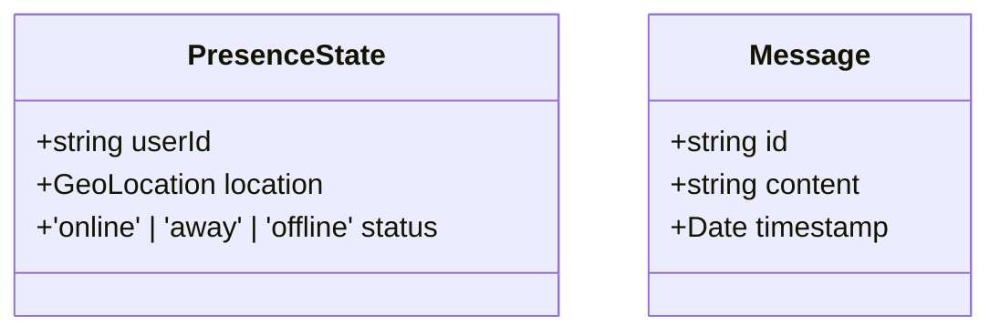

# Type System Architecture

## Core Principles
1. **Explicit over Any**: All entities must have concrete types
2. **Domain-Driven Types**: Types reflect business domain concepts
3. **Centralized Definitions**: All types live in `types/index.ts`

## Key Interfaces

