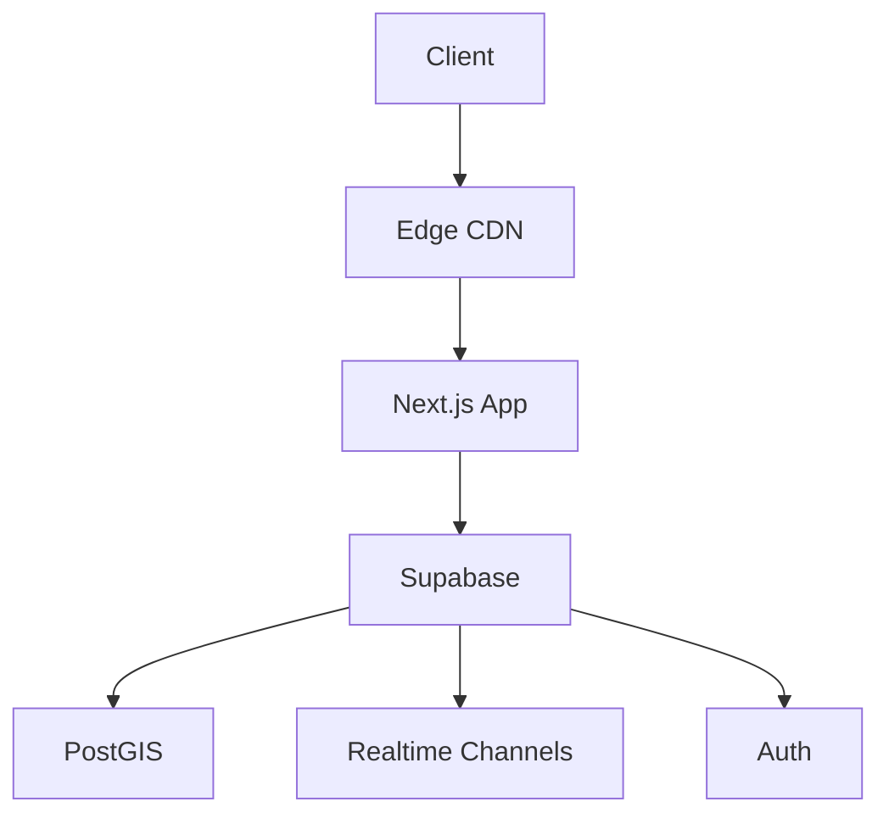

# Dating App Technical Specification and Implementation Plan

## Overview

### Project Vision

A location-aware dating and social platform that combines real-world interactions with digital features, emphasizing privacy, safety, and innovative AR experiences.

### Core Principles

- Privacy by design
- Mobile-first architecture
- Real-time engagement
- Location-aware features
- Progressive enhancement
- Accessibility
- Safety and moderation

### Target Platforms

- Primary: Progressive Web App (PWA)
- AR Support: Meta Quest/Orion devices
- Browser Support: Modern browsers (last 2 versions)

## Technical Stack

### Frontend

- Next.js 15.0.0 with TypeScript
- NextUI v2.4.8 (primary UI framework)
- Tailwind CSS 3.4.14 for styling
- Framer Motion 11.11.9 for animations
- React Three Fiber 8.17.10/Drei 9.114.6 for 3D/AR
- Mapbox GL JS 3.7.0/React Map GL 7.1.7 for mapping
- PWA capabilities via next-pwa 5.6.0
- React Query 5.60.2 for data fetching
- Emoji Mart for emoji support
- Date-fns 4.1.0 for date handling
- Formik 2.4.6 with Yup 1.4.0 for form handling
- React Dropzone 14.3.5 for file uploads

### Backend & Infrastructure

- Supabase
  - Authentication
  - PostgreSQL database
  - Real-time subscriptions
  - Edge Functions
- Stripe (subscription management)
- Redis (caching, rate limiting)
- AWS S3 (media storage)
- OpenAI API (AI features)
- Meta SDK (AR features)

### Monitoring & Security

- Sentry (error tracking)
- DataDog (performance monitoring)
- MaxMind (GeoIP database)
- Cloudflare (CDN, DDoS protection)
- SendGrid/Postmark (transactional emails)
- Twilio (SMS verification)
- ElasticSearch (search features)

## Feature Sets

### Subscription Tiers

#### Free Tier

- Basic profile creation
- Limited filtering
- Basic matching
- Event viewing
- Basic chat features

#### Regular Subscription ($X/month)

- City-based chat access
- Event creation/management
- 30 min monthly video/audio calls
- Favorites system
- Location proposals
- 10 monthly AI actions
- Basic AR features
- Stream viewing/chat

#### Premium Subscription ($Y/month)

- Unlimited features
- 2000 AI actions monthly
- Global location changing
- Advanced AR features (180°/360° streaming)
- Unlimited video/audio calls
- Priority support
- Advanced matching algorithms

### AI Feature Matrix

1. Event Management

   - Automated guest responses
   - Event scheduling optimization
   - Content moderation
   - Attendance predictions

2. Matching System

   - Profile compatibility analysis
   - Behavioral pattern matching
   - Interest alignment
   - Activity recommendations

3. Safety & Moderation
   - Content screening
   - Risk assessment
   - Report prioritization
   - Automated warning system

### AR Implementation

1. Navigation Features

   - Event location markers
   - Walking direction overlay
   - Parking assistance
   - Entry point identification

2. Social Features
   - Spatial chat bubbles
   - Event highlight sharing
   - Real-time attendee indicators
   - Interactive AR elements

## Performance Targets

### Response Times

- API Response: < 200ms
- Real-time Updates: < 100ms
- Page Load (First Contentful Paint): < 1.5s
- Time to Interactive: < 3s

### Cache Performance

- Cache Hit Ratio: > 85%
- Static Asset Cache Duration: 7 days
- API Cache Duration: Contextual (1min - 1hr)

### PWA Metrics

- Lighthouse Score: > 90
- Offline Functionality: 100% core features
- Install Size: < 5MB
- First Load JS: < 150KB

### Real-time Features

- Message Delivery: < 500ms
- Location Updates: < 1s
- Presence Updates: < 2s

## Security & Compliance

### Data Protection

- End-to-end encryption for messages
- Location data anonymization
- Secure credential storage
- Regular security audits
- Penetration testing schedule

### Compliance Requirements

1. GDPR Compliance

   - Data portability
   - Right to be forgotten
   - Consent management
   - Data processing records

2. CCPA Compliance
   - Privacy policy updates
   - Data collection transparency
   - Opt-out mechanisms
   - Data access requests

### Data Retention

- Chat History: 90 days
- Location Data: 30 days
- User Profiles: Account lifetime
- Event Data: 180 days post-event
- Moderation Logs: 1 year

## Database Schema

### Core Tables

#### users

- id: uuid (PK, references auth.users)
- full_name: text
- avatar_url: text
- age_verified_at: timestamp with time zone
- age_verification_method: text (enum: modal, document)
- birth_date: timestamp with time zone
- is_anonymous: boolean
- billing_address: jsonb
- payment_method: jsonb

#### customers

- id: uuid (PK, references auth.users)
- stripe_customer_id: text

#### products

- id: text (PK)
- active: boolean
- name: text
- description: text
- image: text
- metadata: jsonb

#### prices

- id: text (PK)
- product_id: text (references products)
- active: boolean
- description: text
- unit_amount: bigint
- currency: text
- type: pricing_type (enum: one_time, recurring)

#### subscriptions

- id: text (PK)
- user_id: uuid (references auth.users)
- status: subscription_status

#### profiles

- id: uuid (PK)
- user_id: uuid (FK)
- display_name: string
- bio: text
- preferences: jsonb
- location: geography
- last_location_update: timestamp
- avatar_url: string
- is_online: boolean
- last_active: timestamp
- settings: jsonb

#### events

- id: uuid (PK)
- creator_id: uuid (FK)
- title: string
- description: text
- location: geography
- start_time: timestamp
- end_time: timestamp
- capacity: integer
- privacy_level: enum
- ar_enabled: boolean
- ar_navigation: jsonb
- status: enum

#### messages

- id: uuid (PK)
- sender_id: uuid (FK)
- receiver_id: uuid (FK)
- content: text
- sent_at: timestamp
- read_at: timestamp
- encrypted_content: text
- message_type: enum
- metadata: jsonb

#### city_chats

- id: uuid (PK)
- city_id: string
- name: string
- location: geography
- radius: float
- chat_settings: jsonb
- moderation_level: enum

#### moderation_queue

- id: uuid (PK)
- content_type: enum
- content_id: uuid
- reporter_id: uuid
- reason: string
- status: enum
- priority: integer
- ai_assessment: jsonb
- resolved_at: timestamp

#### subscriptions

- id: uuid (PK)
- user_id: uuid (FK)
- stripe_customer_id: string
- stripe_subscription_id: string
- tier: enum
- status: enum
- current_period_start: timestamp
- current_period_end: timestamp
- usage_metrics: jsonb

### Junction Tables

#### event_participants

- event_id: uuid (FK)
- user_id: uuid (FK)
- role: enum
- joined_at: timestamp
- status: enum

#### user_relationships

- user_id_1: uuid (FK)
- user_id_2: uuid (FK)
- relationship_type: enum
- created_at: timestamp
- status: enum

## API Structure

### Authentication Endpoints

- POST /auth/register
- POST /auth/login
- POST /auth/verify-age
- POST /auth/refresh-token
- POST /auth/logout

### Profile Endpoints

- GET /profile
- PUT /profile
- GET /profile/:id
- PUT /profile/location
- GET /profile/matches

### Event Endpoints

- POST /events
- GET /events
- GET /events/:id
- PUT /events/:id
- POST /events/:id/join
- POST /events/:id/ar-navigation

### Chat Endpoints

- GET /chats
- POST /chats/message
- GET /chats/city/:id
- POST /chats/city/:id/join
- GET /chats/history

### Subscription Endpoints

- GET /subscription
- POST /subscription/create
- PUT /subscription/update
- POST /subscription/cancel

### Moderation Endpoints

- POST /moderation/report
- GET /moderation/queue
- PUT /moderation/resolve
- POST /moderation/appeal

## Development Workflow

### Local Development

[Continued in next part...]

## Current Implementation Status

### Authentication System

- Multi-step registration flow implemented
- Age verification modal requirement
- Email verification process
- Anonymous user support

### Component Structure

#### Authentication Forms

- MultiStepSignUp

  - Purpose: Handles staged registration process
  - Integration: Supabase auth
  - State Management: Form state with validation

- BotChecker

  - Purpose: Automated verification
  - Integration: Security measures
  - Implementation: Human verification steps

- EmailVerification
  - Purpose: Email confirmation flow
  - Integration: Supabase email verification
  - State: Verification status tracking

#### Layout Components

- App Layout
  - Structure: Main application wrapper
  - Features: Navigation, authentication state
  - Responsive Design: Mobile-first approach

### Data Flow Architecture

#### Authentication Flow

#### Authentication Flow Types

```typescript
interface AuthState {
  user: User | null;
  session: Session | null;
  isLoading: boolean;
  error: Error | null;
}

interface RegistrationStep {
  id: string;
  isCompleted: boolean;
  isRequired: boolean;
  validationRules: ValidationRule[];
}

interface AgeVerification {
  isVerified: boolean;
  verifiedAt: Date;
  method: 'modal' | 'document' | 'other';
}

interface LocationState {
  currentLocation: Coordinates | null;
  selectedCity: CityData | null;
  travelMode: boolean;
  locationPermission: 'granted' | 'denied' | 'prompt';
}

interface SubscriptionState {
  tier: 'free' | 'regular' | 'premium';
  features: Feature[];
  usage: UsageMetrics;
  billingStatus: BillingStatus;
}
```

#### Real-time Communication Types

```typescript
interface ChatMessage {
  id: string;
  content: string;
  senderId: string;
  receiverId: string;
  type: 'text' | 'media' | 'location' | 'ar';
  metadata: {
    location?: Coordinates;
    arContent?: ARContent;
    attachments?: Attachment[];
    reactions?: Reaction[];
  };
  status: 'sent' | 'delivered' | 'read';
  encryption: {
    algorithm: string;
    publicKey: string;
    signature: string;
  };
}

interface RealtimePresence {
  user: {
    id: string;
    status: 'online' | 'offline' | 'away';
    lastSeen: Date;
    location?: Coordinates;
  };
  channel: string;
  metadata?: Record<string, unknown>;
}
```

### Feature Implementation Status

#### Core Features Implementation

```typescript
interface AuthImplementation {
  multiStepRegistration: {
    status: 'completed';
    components: [
      'AgeVerification',
      'EmailSignup',
      'BotCheck',
      'ProfileCreation'
    ];
    validation: 'implemented';
  };

  anonymousAccess: {
    status: 'completed';
    restrictions: [
      'age-verification-required',
      'limited-feature-access',
      'temporary-session'
    ];
  };
}

interface LocationImplementation {
  status: 'in-progress';
  completed: [
    'basic-geolocation',
    'permission-handling',
    'coordinate-tracking'
  ];
  pending: [
    'city-boundary-detection',
    'dynamic-radius-calculation',
    'location-based-matching'
  ];
}
```

### Development Guidelines

#### Code Organization

```typescript
interface ProjectStructure {
  features: {
    auth: {
      components: string[];
      utils: string[];
      types: string[];
    };
    location: {
      components: string[];
      utils: string[];
      types: string[];
    };
    chat: {
      components: string[];
      utils: string[];
      types: string[];
    };
  };
  shared: {
    components: string[];
    hooks: string[];
    utils: string[];
  };
}
```

#### State Management Patterns

```typescript
interface StateManagement {
  auth: {
    provider: 'context';
    scope: 'global';
    persistence: 'session';
  };
  location: {
    provider: 'context';
    scope: 'global';
    updates: 'realtime';
  };
  chat: {
    provider: 'context';
    scope: 'feature';
    updates: 'realtime';
  };
}
```

### Performance Optimization

#### Client-side Optimization

```typescript
interface ClientOptimization {
  bundleSize: {
    initial: string; // Target: < 150KB
    subsequent: string; // Target: < 50KB
  };
  imageOptimization: {
    formats: ['webp', 'avif'];
    lazy: boolean;
    placeholder: 'blur' | 'dominant-color';
  };
  caching: {
    strategy: 'stale-while-revalidate';
    duration: Record<string, number>;
  };
}
```

### Testing Strategy

#### Unit Testing

```typescript
interface TestingImplementation {
  components: {
    coverage: number; // Target: 80%
    framework: 'Jest';
    patterns: [
      'component-isolation',
      'prop-validation',
      'event-handling',
      'state-changes'
    ];
  };
  utils: {
    coverage: number; // Target: 90%
    patterns: ['input-validation', 'error-handling', 'edge-cases'];
  };
}
```

#### Integration Testing

```typescript
interface IntegrationTests {
  flows: [
    'authentication',
    'location-services',
    'chat-system',
    'subscription-management'
  ];
  coverage: {
    critical: number; // Target: 90%
    nonCritical: number; // Target: 70%
  };
  environments: ['development', 'staging', 'production'];
}
```

### PWA Implementation

#### Service Worker Strategy

```typescript
interface ServiceWorkerConfig {
  caching: {
    static: {
      strategy: 'cache-first';
      maxAge: number; // 7 days
      assets: string[]; // ['fonts', 'images', 'styles']
    };
    dynamic: {
      strategy: 'stale-while-revalidate';
      maxAge: number; // 1 hour
      maxItems: number; // 100
    };
    api: {
      strategy: 'network-first';
      timeout: number; // 3 seconds
      fallback: 'cache' | 'error';
    };
  };
  offline: {
    fallback: string; // '/offline'
    assets: string[]; // Critical assets for offline functionality
    routes: {
      path: string;
      strategy: 'cache-first' | 'network-first';
    }[];
  };
  sync: {
    background: boolean;
    periodicSync: boolean;
    syncTags: ['messages', 'location-updates', 'profile-changes'];
  };
}

interface PushNotification {
  types: {
    chat: {
      priority: 'high' | 'normal';
      ttl: number; // Time to live
      actions: string[];
    };
    event: {
      priority: 'high' | 'normal';
      ttl: number;
      actions: string[];
    };
    match: {
      priority: 'normal';
      ttl: number;
      actions: string[];
    };
    system: {
      priority: 'high';
      ttl: number;
      actions: string[];
    };
  };
  channels: {
    web: boolean;
    email: boolean;
    sms: boolean;
  };
  preferences: UserNotificationPreferences;
}
```

### AR Feature Implementation

#### Navigation System

```typescript
interface ARNavigation {
  markers: {
    type: 'parking' | 'entrance' | 'meetingPoint';
    position: {
      x: number;
      y: number;
      z: number;
    };
    metadata: {
      title: string;
      description: string;
      icon: string;
      interactable: boolean;
    };
  }[];
  paths: {
    points: {
      x: number;
      y: number;
      z: number;
    }[];
    type: 'walking' | 'accessibility';
    difficulty: 'easy' | 'moderate' | 'difficult';
    markers: {
      position: number; // Index in points array
      type: 'direction' | 'warning' | 'info';
      content: string;
    }[];
  }[];
  overlay: {
    type: '2d' | '3d';
    content: {
      model?: string; // URL to 3D model
      image?: string; // URL to image
      text?: string;
    };
    interaction: {
      type: 'tap' | 'proximity' | 'gaze';
      action: () => void;
      feedback: 'haptic' | 'visual' | 'audio';
    };
  };
  settings: {
    renderDistance: number;
    updateFrequency: number;
    detailLevel: 'high' | 'medium' | 'low';
    performance: {
      maxMarkers: number;
      culling: boolean;
      lodBias: number;
    };
  };
}
```

### Development Commands and Scripts

```bash
# Supabase Commands
npm run supabase:start        # Start local Supabase
npm run supabase:stop         # Stop local Supabase
npm run supabase:status       # Check Supabase status
npm run supabase:reset        # Reset Supabase database
npm run supabase:link         # Link to Supabase project
npm run supabase:generate-types # Generate TypeScript types
npm run supabase:generate-migration # Generate new migration
npm run supabase:generate-seed # Generate seed data
npm run supabase:push         # Push database changes
npm run supabase:pull         # Pull database changes

# Development Commands
npm run dev                   # Start development server with Turbo
npm run build                 # Build production
npm run start                 # Start production server
npm run lint                  # Run ESLint
npm run prettier-fix          # Format code

# Stripe Commands
npm run stripe:login          # Login to Stripe CLI
npm run stripe:listen         # Start Stripe webhook listener
npm run stripe:fixtures       # Load Stripe test data
```

### Current Project Structure

```
├── app/
│   ├── auth/
│   │   ├── callback/
│   │   │   └── route.ts        # Auth callback handler
│   │   ├── login/
│   │   │   └── page.tsx        # Login page
│   │   └── register/
│   │       └── page.tsx        # Registration page
│   ├── app/
│   │   ├── layout.tsx          # Protected app layout
│   │   ├── chat/
│   │   ├── events/
│   │   └── profile/
│   ├── landing/
│   │   └── page.tsx            # Public landing page
│   └── page.tsx                # Root page
├── components/
│   ├── ui/
│   │   ├── AuthForms/
│   │   │   ├── UserRegistration/
│   │   │   │   ├── MultiStepSignUp.tsx
│   │   │   │   ├── BotChecker.tsx
│   │   │   │   └── EmailVerification.tsx
│   │   │   ├── LoginForm.tsx
│   │   │   └── SignUpForm.tsx
│   │   ├── Navigation/
│   │   ├── Chat/
│   │   ├── Events/
│   │   └── AR/
│   └── features/
│       ├── LocationServices/
│       ├── Subscriptions/
│       └── Moderation/
├── utils/
│   ├── auth-helpers/
│   │   ├── server.ts           # Server-side auth utilities
│   │   └── client.ts           # Client-side auth utilities
│   ├── supabase/
│   │   ├── client.ts           # Supabase client initialization
│   │   └── server.ts           # Server-side Supabase utilities
│   ├── location/
│   ├── ar/
│   └── encryption/
├─ types/
│   ├── database.types.ts       # Generated Supabase types
│   ├── auth.types.ts
│   ├── location.types.ts
│   └── ar.types.ts
├── middleware.ts               # Auth middleware
└── package.json               # Project dependencies and scripts
```

### Implementation Priorities

#### Current Focus (Sprint 1-2)

1. Authentication System

   - ✅ Multi-step registration
   - ✅ Age verification
   - ✅ Email verification
   - 🚧 Profile creation

2. Location Services

   - ✅ Basic geolocation
   - 🚧 City-based chat
   - 📅 Location-based matching

3. Core Features
   - 🚧 Basic chat functionality
   - 📅 Event creation
   - 📅 Subscription integration

#### Next Phase (Sprint 3-4)

1. Enhanced Features

   - AR navigation implementation
   - Advanced chat features
   - Event management
   - Payment processing

2. Performance Optimization
   - PWA implementation
   - Caching strategy
   - Asset optimization

#### Future Enhancements (Sprint 5+)

1. Advanced Features
   - AI integration
   - Enhanced AR capabilities
   - Advanced matching algorithms
   - Global chat system

Legend:

- ✅ Completed
- 🚧 In Progress
- 📅 Planned

### Deployment Strategy

#### Environment Configuration

```typescript
interface DeploymentConfig {
  environments: {
    development: {
      url: string;
      variables: Record<string, string>;
      features: string[];
    };
    staging: {
      url: string;
      variables: Record<string, string>;
      features: string[];
    };
    production: {
      url: string;
      variables: Record<string, string>;
      features: string[];
    };
  };
  deployment: {
    strategy: 'blue-green';
    rollback: {
      automatic: boolean;
      conditions: string[];
    };
    healthChecks: {
      endpoints: string[];
      interval: number;
      timeout: number;
    };
  };
}
```

#### CI/CD Pipeline

```yaml
pipeline:
  stages:
    - build:
        steps:
          - type-check
          - lint
          - test
          - build
    - deploy:
        environments:
          staging:
            - deploy-infrastructure
            - run-migrations
            - deploy-application
            - health-check
          production:
            - approval
            - deploy-infrastructure
            - run-migrations
            - deploy-application
            - health-check
    - monitoring:
        steps:
          - error-tracking
          - performance-monitoring
          - usage-analytics
```

### Monitoring Setup

#### Application Monitoring

```typescript
interface MonitoringSystem {
  metrics: {
    performance: {
      responseTime: Metric;
      errorRate: Metric;
      userSessions: Metric;
    };
    business: {
      activeUsers: Metric;
      messagesSent: Metric;
      eventsCreated: Metric;
    };
    infrastructure: {
      cpuUsage: Metric;
      memoryUsage: Metric;
      networkTraffic: Metric;
    };
  };
  alerts: {
    critical: {
      conditions: string[];
      notifications: string[];
    };
    warning: {
      conditions: string[];
      notifications: string[];
    };
  };
  logging: {
    levels: ['error', 'warn', 'info', 'debug'];
    retention: {
      error: '30d';
      warn: '14d';
      info: '7d';
      debug: '3d';
    };
  };
}
```

### Error Handling Patterns

#### Global Error Handler

```typescript
interface ErrorHandling {
  types: {
    ValidationError: ErrorConfig;
    AuthenticationError: ErrorConfig;
    NetworkError: ErrorConfig;
    DatabaseError: ErrorConfig;
    ThirdPartyError: ErrorConfig;
  };
  reporting: {
    automatic: boolean;
    severity: 'low' | 'medium' | 'high' | 'critical';
    context: {
      user: boolean;
      session: boolean;
      environment: boolean;
    };
  };
  recovery: {
    retry: {
      maxAttempts: number;
      backoffStrategy: 'linear' | 'exponential';
    };
    fallback: {
      offline: boolean;
      degradedMode: boolean;
    };
  };
}
```

### Security Implementation Details

#### Authentication Security

```typescript
interface SecurityImplementation {
  authentication: {
    session: {
      duration: number;
      renewal: 'sliding' | 'fixed';
      inactivityTimeout: number;
    };
    mfa: {
      enabled: boolean;
      methods: ['email', 'sms', 'authenticator'];
      recovery: boolean;
    };
    rateLimit: {
      login: RateLimit;
      registration: RateLimit;
      passwordReset: RateLimit;
    };
  };
  encryption: {
    atRest: {
      algorithm: string;
      keyRotation: boolean;
      backups: boolean;
    };
    inTransit: {
      protocol: 'TLS 1.3';
      certificates: 'managed';
      hsts: boolean;
    };
  };
  authorization: {
    rbac: {
      roles: string[];
      permissions: string[];
      inheritance: boolean;
    };
    contextual: {
      location: boolean;
      time: boolean;
      deviceType: boolean;
    };
  };
}
```

### Database Migration Strategy

#### Migration Management

```sql
-- Migration Tracking Table
create table migrations (
  id uuid primary key default uuid_generate_v4(),
  name text not null unique,
  version text not null,
  description text,
  applied_at timestamp with time zone default current_timestamp,
  applied_by text,
  checksum text,
  execution_time integer,
  status text default 'pending',
  rollback_script text,
  dependencies text[],
  metadata jsonb
);

-- Migration Validation Function
create or replace function validate_migration(
  migration_name text,
  expected_checksum text
)
returns boolean as $$
declare
  current_checksum text;
begin
  select checksum into current_checksum
  from migrations
  where name = migration_name;

  return current_checksum = expected_checksum;
end;
$$ language plpgsql security definer;

-- Migration Rollback Function
create or replace function rollback_migration(
  migration_name text
)
returns void as $$
declare
  rollback_sql text;
begin
  -- Get rollback script
  select rollback_script into rollback_sql
  from migrations
  where name = migration_name;

  if rollback_sql is null then
    raise exception 'No rollback script available for migration %', migration_name;
  end if;

  -- Execute rollback
  execute rollback_sql;

  -- Update migration status
  update migrations
  set status = 'rolled_back',
      applied_at = current_timestamp
  where name = migration_name;
end;
$$ language plpgsql security definer;
```

#### Migration Scripts Structure

```typescript
interface MigrationFile {
  name: string;
  version: string;
  description: string;
  dependencies: string[];
  up: {
    sql: string;
    validation: string[];
    estimated_duration: number;
  };
  down: {
    sql: string;
    validation: string[];
    estimated_duration: number;
  };
  metadata: {
    author: string;
    date: string;
    type: 'schema' | 'data' | 'function';
    risk_level: 'low' | 'medium' | 'high';
    requires_downtime: boolean;
  };
}
```

#### Migration Management Commands

```bash
# Generate new migration
npm run migration:create -- --name "add_user_preferences"

# Apply pending migrations
npm run migration:up

# Rollback last migration
npm run migration:down

# Validate migrations
npm run migration:validate

# Show migration status
npm run migration:status
```

#### Migration Scheduling System

```sql
-- Migration Schedule Table
create table migration_schedule (
  id uuid primary key default uuid_generate_v4(),
  migration_name text references migrations(name),
  scheduled_time timestamp with time zone not null,
  maintenance_window jsonb,
  notification_sent boolean default false,
  completed boolean default false,
  completion_time timestamp with time zone,
  error_log text,
  metadata jsonb
);

-- Notification Function for Scheduled Migrations
create or replace function notify_scheduled_migration()
returns trigger as $$
begin
  -- Implementation for notification system
  -- (Email, Slack, etc.)
  return new;
end;
$$ language plpgsql security definer;

-- Create notification trigger
create trigger migration_schedule_notification
  before insert or update on migration_schedule
  for each row
  execute function notify_scheduled_migration();
```

#### Migration Validation System

```typescript
interface MigrationValidation {
  preChecks: {
    dependencies: boolean;
    databaseConnection: boolean;
    diskSpace: boolean;
    permissions: boolean;
  };
  validation: {
    schemaIntegrity: boolean;
    dataConsistency: boolean;
    foreignKeys: boolean;
    uniqueConstraints: boolean;
  };
  postChecks: {
    rowCount: boolean;
    performance: boolean;
    indexes: boolean;
    permissions: boolean;
  };
  rollback: {
    planAvailable: boolean;
    tested: boolean;
    estimatedDuration: number;
  };
}
```

### User and Profile System

```sql
-- User Role Enumeration
create type user_role as enum ('admin', 'moderator', 'subscriber', 'free', 'anon');

-- Users Table
create table users (
  id uuid primary key default uuid_generate_v4(),
  email text unique not null,
  phone text unique,
  password_hash text not null,
  role user_role not null default 'free',
  created_at timestamp with time zone default current_timestamp,
  last_login timestamp with time zone,
  is_email_verified boolean default false,
  is_phone_verified boolean default false,
  two_factor_enabled boolean default false,
  account_status text default 'active',
  preferred_language text default 'en',
  notification_preferences jsonb,
  full_name text,
  avatar_url text,
  billing_address jsonb,
  payment_method jsonb
);

-- Profiles Table
create table profiles (
  id uuid primary key references users(id) not null,
  username text unique,
  display_name text,
  bio text,
  preferences jsonb,
  location geography,
  last_location_update timestamp,
  avatar_url text,
  is_online boolean,
  last_active timestamp,
  settings jsonb,
  birth_date date,
  gender text,
  pronouns text[],
  orientation text,
  relationship_status text,
  height integer,
  weight integer,
  body_type text,
  ethnicity text[],
  city text,
  country text,
  languages text[],
  occupation text,
  education_level text,
  smoking_status text,
  drinking_status text,
  cannabis_status text,
  children_status text,
  pets text[],
  interests text[],
  kinks text[],
  sexual_positions text[],
  safe_sex_practices text[],
  hiv_status text,
  last_tested_date date,
  profile_picture_url text,
  gallery_picture_urls text[],
  is_verified boolean default false,
  verification_date timestamp with time zone,
  privacy_settings jsonb,
  blocked_users uuid[],
  favorite_users uuid[]
);
```

```typescript
// Corresponding TypeScript Types
interface User {
  id: string;
  email: string;
  phone?: string;
  role: UserRole;
  created_at: Date;
  last_login?: Date;
  is_email_verified: boolean;
  is_phone_verified: boolean;
  two_factor_enabled: boolean;
  account_status: string;
  preferred_language: string;
  notification_preferences: NotificationPreferences;
  full_name?: string;
  avatar_url?: string;
  billing_address?: BillingAddress;
  payment_method?: PaymentMethod;
}

interface Profile {
  id: string;
  username?: string;
  display_name?: string;
  bio?: string;
  birth_date?: Date;
  gender?: string;
  pronouns?: string[];
  orientation?: string;
  relationship_status?: string;
  height?: number;
  weight?: number;
  body_type?: string;
  ethnicity?: string[];
  location?: Geography;
  city?: string;
  country?: string;
  languages?: string[];
  occupation?: string;
  education_level?: string;
  smoking_status?: string;
  drinking_status?: string;
  cannabis_status?: string;
  children_status?: string;
  pets?: string[];
  interests?: string[];
  kinks?: string[];
  sexual_positions?: string[];
  safe_sex_practices?: string[];
  hiv_status?: string;
  last_tested_date?: Date;
  profile_picture_url?: string;
  gallery_picture_urls?: string[];
  is_verified: boolean;
  verification_date?: Date;
  last_active?: Date;
  privacy_settings: PrivacySettings;
  blocked_users: string[];
  favorite_users: string[];
}
```

### Additional Database Schema and Type Definitions

#### Sexual Preferences and Health Information

```sql
-- Sexual Preferences Table
create table sexual_preferences (
  user_id uuid primary key references users(id),
  preferred_genders text[],
  preferred_age_min integer,
  preferred_age_max integer,
  preferred_distance integer,
  preferred_relationship_types text[],
  preferred_kinks text[],
  preferred_sexual_positions text[],
  dealbreakers text[]
);

-- Health Information Extensions for Profiles
alter table profiles add column into_public text[];
alter table profiles add column looking_for text[];
alter table profiles add column fetishes text[];
alter table profiles add column interaction text[];
alter table profiles add column practices text[];
alter table profiles add column sti_tested date;
alter table profiles add column safeguards text[];
alter table profiles add column not_comfortable_with text[];
alter table profiles add column i_carry text[];
alter table profiles add column endowment text;
alter table profiles add column sexuality text;
alter table profiles add column position text;
alter table profiles add column expression text[];
```

```typescript
interface SexualPreferences {
  user_id: string;
  preferred_genders: string[];
  preferred_age_min: number;
  preferred_age_max: number;
  preferred_distance: number;
  preferred_relationship_types: string[];
  preferred_kinks: string[];
  preferred_sexual_positions: string[];
  dealbreakers: string[];
}

interface HealthInformation {
  sti_tested?: Date;
  hiv_status?: string;
  hiv_tested?: Date;
  safeguards: string[];
  practices: string[];
  i_carry: string[];
  not_comfortable_with: string[];
}
```

#### Subscription and Payment System

```sql
-- Products Table
create table products (
  id text primary key,
  active boolean,
  name text,
  description text,
  image text,
  metadata jsonb
);

-- Prices Table
create type pricing_type as enum ('one_time', 'recurring');
create type pricing_plan_interval as enum ('day', 'week', 'month', 'year');

create table prices (
  id text primary key,
  product_id text references products,
  active boolean,
  description text,
  unit_amount bigint,
  currency text check (char_length(currency) = 3),
  type pricing_type,
  interval pricing_plan_interval,
  interval_count integer,
  trial_period_days integer,
  metadata jsonb
);

-- Subscriptions Table
create type subscription_status as enum (
  'trialing',
  'active',
  'canceled',
  'incomplete',
  'incomplete_expired',
  'past_due',
  'unpaid',
  'paused'
);

create table subscriptions (
  id text primary key,
  user_id uuid references users(id),
  status subscription_status,
  metadata jsonb,
  price_id text references prices,
  quantity integer,
  cancel_at_period_end boolean,
  created timestamp with time zone default timezone('utc'::text, now()) not null,
  current_period_start timestamp with time zone default timezone('utc'::text, now()) not null,
  current_period_end timestamp with time zone default timezone('utc'::text, now()) not null,
  ended_at timestamp with time zone default timezone('utc'::text, now()),
  cancel_at timestamp with time zone default timezone('utc'::text, now()),
  canceled_at timestamp with time zone default timezone('utc'::text, now()),
  trial_start timestamp with time zone default timezone('utc'::text, now()),
  trial_end timestamp with time zone default timezone('utc'::text, now())
);
```

#### Content Moderation System

```sql
-- Content Moderation Queue Table
create table content_moderation_queue (
  id uuid primary key default uuid_generate_v4(),
  content_type text not null,
  content_id uuid not null,
  reporter_id uuid references users(id),
  reported_id uuid references users(id),
  reason text not null,
  description text,
  evidence_urls text[],
  status text default 'pending',
  priority integer default 0,
  assigned_to uuid references users(id),
  created_at timestamp with time zone default current_timestamp,
  updated_at timestamp with time zone default current_timestamp,
  resolved_at timestamp with time zone,
  resolution_notes text,
  ai_assessment jsonb,
  action_taken text,
  appeal_status text,
  appeal_notes text
);

-- Moderation Actions History
create table moderation_actions (
  id uuid primary key default uuid_generate_v4(),
  queue_item_id uuid references content_moderation_queue(id),
  moderator_id uuid references users(id),
  action_type text not null,
  action_details jsonb,
  created_at timestamp with time zone default current_timestamp,
  notes text
);

-- User Reports
create table user_reports (
  id uuid primary key default uuid_generate_v4(),
  reporter_id uuid references users(id),
  reported_user_id uuid references users(id),
  report_type text not null,
  description text,
  evidence_urls text[],
  status text default 'pending',
  created_at timestamp with time zone default current_timestamp,
  resolved_at timestamp with time zone,
  resolution text,
  moderator_notes text
);
```

#### Chat and Messaging System

```sql
-- Chat Rooms Table
create table chat_rooms (
  id uuid primary key default uuid_generate_v4(),
  name text not null,
  type text check (type in ('direct', 'group', 'location')),
  created_at timestamp with time zone default current_timestamp,
  metadata jsonb default '{}'::jsonb
);

-- Chat Participants Table
create table chat_participants (
  chat_room_id uuid references chat_rooms(id),
  user_id uuid references users(id),
  joined_at timestamp with time zone default current_timestamp,
  last_read_at timestamp with time zone default current_timestamp,
  muted_until timestamp with time zone,
  status text default 'active',
  primary key (chat_room_id, user_id)
);

-- Messages Table
create table messages (
  id uuid primary key default uuid_generate_v4(),
  chat_room_id uuid references chat_rooms(id),
  sender_id uuid references users(id),
  content text,
  content_type text default 'text',
  metadata jsonb,
  created_at timestamp with time zone default current_timestamp,
  updated_at timestamp with time zone default current_timestamp,
  edited boolean default false,
  deleted boolean default false,
  parent_id uuid references messages(id),
  read_by uuid[],
  reactions jsonb,
  attachments jsonb[]
);
```

#### Event Management System

```sql
-- Event Types Enum
create type event_type as enum (
  'social',
  'private',
  'cruise',
  'party',
  'meetup'
);

-- Event Status Enum
create type event_status as enum (
  'draft',
  'published',
  'cancelled',
  'completed',
  'suspended'
);

-- Events Table
create table events (
  id uuid primary key default uuid_generate_v4(),
  creator_id uuid references users(id) not null,
  title text not null,
  description text,
  event_type event_type not null,
  status event_status default 'draft',
  start_time timestamp with time zone not null,
  end_time timestamp with time zone not null,
  location geography(point) not null,
  address text,
  city text,
  max_participants integer,
  current_participants integer default 0,
  is_private boolean default false,
  entry_requirements jsonb,
  ar_enabled boolean default false,
  ar_navigation jsonb,
  cover_image_url text,
  gallery_urls text[],
  created_at timestamp with time zone default current_timestamp,
  updated_at timestamp with time zone default current_timestamp,
  metadata jsonb
);

-- RLS Policies for Events
alter table events enable row level security;

-- Creators can do everything with their own events
create policy "Users can manage their own events"
  on events
  for all
  using (auth.uid() = creator_id);

-- Public events are visible to all verified users
create policy "Users can view public events"
  on events
  for select
  using (
    not is_private
    and status = 'published'
    and exists (
      select 1 from users
      where id = auth.uid()
      and is_email_verified = true
    )
  );

-- Event Participants Table
create table event_participants (
  event_id uuid references events(id) on delete cascade,
  user_id uuid references users(id) on delete cascade,
  role text default 'attendee',
  rsvp_status text not null,
  rsvp_time timestamp with time zone default current_timestamp,
  check_in_time timestamp with time zone,
  check_out_time timestamp with time zone,
  notes text,
  primary key (event_id, user_id)
);

-- RLS Policies for Event Participants
alter table event_participants enable row level security;

-- Users can manage their own participation
create policy "Users can manage their own participation"
  on event_participants
  for all
  using (auth.uid() = user_id);

-- Event creators can view all participants
create policy "Event creators can view participants"
  on event_participants
  for select
  using (
    exists (
      select 1 from events
      where events.id = event_participants.event_id
      and events.creator_id = auth.uid()
    )
  );

-- Event AR Features Table
create table event_ar_features (
  id uuid primary key default uuid_generate_v4(),
  event_id uuid references events(id) on delete cascade,
  feature_type text not null,
  location geography(point),
  content jsonb,
  active boolean default true,
  created_by uuid references users(id),
  created_at timestamp with time zone default current_timestamp,
  updated_at timestamp with time zone default current_timestamp
);

-- RLS Policies for AR Features
alter table event_ar_features enable row level security;

-- Event creators can manage AR features
create policy "Event creators can manage AR features"
  on event_ar_features
  for all
  using (
    exists (
      select 1 from events
      where events.id = event_ar_features.event_id
      and events.creator_id = auth.uid()
    )
  );

-- Participants can view AR features
create policy "Participants can view AR features"
  on event_ar_features
  for select
  using (
    exists (
      select 1 from event_participants
      where event_participants.event_id = event_ar_features.event_id
      and event_participants.user_id = auth.uid()
    )
  );
```

#### Location Services System

```sql
-- City Boundaries Table
create table city_boundaries (
  id uuid primary key default uuid_generate_v4(),
  name text not null,
  state text,
  country text not null,
  boundary geography(polygon) not null,
  population integer,
  timezone text,
  default_radius float,
  created_at timestamp with time zone default current_timestamp,
  updated_at timestamp with time zone default current_timestamp
);

-- RLS Policies for City Boundaries
alter table city_boundaries enable row level security;

-- Public read access for verified users
create policy "Verified users can view city boundaries"
  on city_boundaries
  for select
  using (
    exists (
      select 1 from users
      where id = auth.uid()
      and is_email_verified = true
    )
  );

-- Location History Table
create table location_history (
  id uuid primary key default uuid_generate_v4(),
  user_id uuid references users(id),
  location geography,
  accuracy float,
  timestamp timestamp with time zone default current_timestamp,
  device_type text,
  ip_address inet,
  metadata jsonb
);

-- RLS Policies for Location History
alter table location_history enable row level security;

-- Users can only access their own location history
create policy "Users can manage their location history"
  on location_history
  for all
  using (auth.uid() = user_id);

-- Travel Mode Locations
create table travel_mode_locations (
  id uuid primary key default uuid_generate_v4(),
  user_id uuid references users(id),
  original_location geography,
  travel_location geography,
  start_time timestamp with time zone default current_timestamp,
  end_time timestamp with time zone,
  status text default 'active',
  metadata jsonb
);

-- RLS Policies for Travel Mode
alter table travel_mode_locations enable row level security;

-- Users can only manage their own travel mode
create policy "Users can manage their travel mode"
  on travel_mode_locations
  for all
  using (auth.uid() = user_id);
```

#### Analytics and Metrics System

```sql
-- User Analytics Table
create table user_analytics (
  id uuid primary key default uuid_generate_v4(),
  user_id uuid references users(id),
  event_type text not null,
  event_data jsonb,
  session_id uuid,
  timestamp timestamp with time zone default current_timestamp,
  device_info jsonb,
  location geography,
  metadata jsonb
);

-- RLS Policies for User Analytics
alter table user_analytics enable row level security;

-- Users can only view their own analytics
create policy "Users can view their own analytics"
  on user_analytics
  for select
  using (auth.uid() = user_id);

-- Admins can view all analytics
create policy "Admins can view all analytics"
  on user_analytics
  for select
  using (
    exists (
      select 1 from users
      where id = auth.uid()
      and role = 'admin'
    )
  );

-- Performance Metrics Table
create table performance_metrics (
  id uuid primary key default uuid_generate_v4(),
  metric_type text not null,
  value float not null,
  timestamp timestamp with time zone default current_timestamp,
  endpoint text,
  response_time integer,
  error_count integer,
  user_count integer,
  metadata jsonb
);

-- Feature Usage Analytics
create table feature_usage (
  id uuid primary key default uuid_generate_v4(),
  feature_name text not null,
  user_id uuid references users(id),
  usage_count integer default 1,
  first_used timestamp with time zone default current_timestamp,
  last_used timestamp with time zone default current_timestamp,
  success_rate float,
  average_duration integer,
  metadata jsonb
);

-- Error Tracking
create table error_logs (
  id uuid primary key default uuid_generate_v4(),
  error_type text not null,
  error_message text,
  stack_trace text,
  user_id uuid references users(id),
  session_id uuid,
  timestamp timestamp with time zone default current_timestamp,
  severity text,
  resolved boolean default false,
  resolution_notes text,
  metadata jsonb
);
```

#### User Preferences and Settings

```sql
-- User Settings Table
create table user_settings (
  user_id uuid primary key references users(id),
  theme text default 'system',
  language text default 'en',
  timezone text,
  notifications jsonb default '{
    "push": true,
    "email": true,
    "sms": false,
    "marketing": false
  }'::jsonb,
  privacy jsonb default '{
    "profile_visibility": "public",
    "location_sharing": "friends",
    "activity_status": "online"
  }'::jsonb,
  feature_flags jsonb default '{
    "beta_features": false,
    "experimental": false
  }'::jsonb,
  ui_preferences jsonb default '{
    "density": "comfortable",
    "animations": true
  }'::jsonb,
  created_at timestamp with time zone default current_timestamp,
  updated_at timestamp with time zone default current_timestamp
);

-- RLS Policies for User Settings
alter table user_settings enable row level security;

-- Users can manage their own settings
create policy "Users can manage their own settings"
  on user_settings
  for all
  using (auth.uid() = user_id);

-- Notification Preferences
create table notification_preferences (
  user_id uuid primary key references users(id),
  chat_messages boolean default true,
  event_updates boolean default true,
  matches boolean default true,
  system_announcements boolean default true,
  marketing_emails boolean default false,
  quiet_hours jsonb default '{
    "enabled": false,
    "start": "22:00",
    "end": "08:00",
    "timezone": "UTC"
  }'::jsonb,
  channel_preferences jsonb default '{
    "push": ["chat", "matches", "events"],
    "email": ["system", "marketing"],
    "sms": []
  }'::jsonb,
  updated_at timestamp with time zone default current_timestamp
);

-- RLS Policies for Notification Preferences
alter table notification_preferences enable row level security;

create policy "Users can manage their notification preferences"
  on notification_preferences
  for all
  using (auth.uid() = user_id);
```

### Function-based Security Policies

```sql
-- Function to check if user is admin
create or replace function is_admin()
returns boolean as $$
begin
  return exists (
    select 1 from users
    where id = auth.uid()
    and role = 'admin'
  );
end;
$$ language plpgsql security definer;

-- Function to check if user is moderator
create or replace function is_moderator()
returns boolean as $$
begin
  return exists (
    select 1 from users
    where id = auth.uid()
    and role in ('admin', 'moderator')
  );
end;
$$ language plpgsql security definer;

-- Function to check if user has active subscription
create or replace function has_active_subscription()
returns boolean as $$
begin
  return exists (
    select 1 from subscriptions
    where user_id = auth.uid()
    and status = 'active'
  );
end;
$$ language plpgsql security definer;

-- Function to check if user is verified
create or replace function is_verified_user()
returns boolean as $$
begin
  return exists (
    select 1 from users
    where id = auth.uid()
    and is_email_verified = true
  );
end;
$$ language plpgsql security definer;

-- Function to check if user is in same city
create or replace function is_in_same_city(target_user_id uuid)
returns boolean as $$
begin
  return exists (
    select 1 from profiles p1
    join profiles p2 on ST_DWithin(
      p1.location::geography,
      p2.location::geography,
      50000  -- 50km radius
    )
    where p1.user_id = auth.uid()
    and p2.user_id = target_user_id
  );
end;
$$ language plpgsql security definer;
```

### Cross-table Security Policies

```sql
-- Policy for chat access based on location and subscription
create policy "Chat access based on location and subscription"
  on chat_rooms
  for select
  using (
    (
      -- User has active subscription
      has_active_subscription()
      and
      -- User is in the same city as the chat room
      ST_DWithin(
        location::geography,
        (select location from profiles where user_id = auth.uid())::geography,
        50000  -- 50km radius
      )
    )
    or
    -- Or user is admin/moderator
    is_moderator()
  );

-- Policy for event visibility based on privacy and location
create policy "Event visibility based on privacy and location"
  on events
  for select
  using (
    (
      -- Public events
      not is_private
      and
      -- User is in the same city
      ST_DWithin(
        location::geography,
        (select location from profiles where user_id = auth.uid())::geography,
        50000  -- 50km radius
      )
    )
    or
    -- Private events where user is invited
    exists (
      select 1 from event_participants
      where event_id = events.id
      and user_id = auth.uid()
    )
    or
    -- Or user is admin/moderator
    is_moderator()
  );

-- Policy for profile visibility based on blocking and privacy settings
create policy "Profile visibility based on blocking and privacy"
  on profiles
  for select
  using (
    -- Not blocked by the user
    not (auth.uid() = any(blocked_users))
    and
    (
      -- Public profile
      (privacy_settings->>'profile_visibility')::text = 'public'
      or
      -- Or user has active subscription
      has_active_subscription()
      or
      -- Or user is in same city
      is_in_same_city(id)
      or
      -- Or user is admin/moderator
      is_moderator()
    )
  );
```

### Meta XR Integration

#### Web-based AR/VR Implementation

```typescript
interface WebXRImplementation {
  features: {
    webXR: {
      enabled: boolean;
      requirements: {
        webXRAPI: boolean;
        webGL2: boolean;
        deviceMotion: boolean;
      };
      modes: {
        AR: 'immersive-ar';
        VR: 'immersive-vr';
        inline: 'inline';
      };
    };
    sparkAR: {
      webAPI: boolean;
      effects: string[];
      targetPlatforms: ['instagram', 'facebook', 'messenger'];
    };
  };
  contentDelivery: {
    formats: {
      models: ['glb', 'gltf'];
      textures: ['ktx2', 'basis'];
      video: ['mp4', 'webm'];
    };
    optimization: {
      compression: boolean;
      textureCompression: boolean;
      meshOptimization: boolean;
      levelOfDetail: boolean;
    };
  };
  streaming: {
    video: {
      formats: {
        '180': {
          resolution: '2880x1440';
          fps: 60;
          codec: 'h264';
        };
        '360': {
          resolution: '3840x1920';
          fps: 60;
          codec: 'h264';
        };
      };
      adaptiveBitrate: boolean;
      latencyMode: 'low-latency' | 'quality';
    };
    realtime: {
      protocol: 'webrtc';
      p2p: boolean;
      bandwidth: {
        min: number;
        target: number;
        max: number;
      };
    };
  };
}

interface ARFeatures {
  spatialMapping: {
    enabled: boolean;
    resolution: 'high' | 'medium' | 'low';
    updateFrequency: number;
    maxRange: number;
  };
  tracking: {
    imageTracking: boolean;
    planeDetection: boolean;
    objectTracking: boolean;
    faceTracking: boolean;
    handTracking: boolean;
  };
  rendering: {
    shadows: boolean;
    occlusion: boolean;
    environmentalLighting: boolean;
    antiAliasing: boolean;
  };
  interaction: {
    gestures: {
      tap: boolean;
      pinch: boolean;
      rotate: boolean;
      swipe: boolean;
    };
    controllers: {
      raycast: boolean;
      haptics: boolean;
      buttons: boolean;
    };
  };
}
```

#### Device-specific Optimizations

```typescript
interface DeviceOptimizations {
  quest: {
    targetFrameRate: 90;
    renderResolution: {
      width: 1832;
      height: 1920;
    };
    foveatedRendering: {
      enabled: true;
      level: 'dynamic' | 'fixed';
    };
    handTracking: {
      version: 2.0;
      frequency: 60;
    };
  };
  webXR: {
    fallbacks: {
      noAR: 'camera-view';
      noVR: '360-viewer';
      noHandTracking: 'touch-controls';
    };
    progressive: {
      loadingStrategy: 'progressive' | 'eager';
      qualityLevels: ['low', 'medium', 'high'];
    };
  };
  mobile: {
    arCore: {
      minVersion: '1.31.0';
      features: string[];
    };
    arKit: {
      minVersion: '4.0';
      features: string[];
    };
    webAR: {
      engines: ['8thwall', 'zappar', 'webxr'];
      fallback: '2d-view';
    };
  };
}
```

#### Content Creation Tools

```typescript
interface ContentCreationTools {
  sparkAR: {
    studio: {
      version: string;
      features: string[];
      exportFormats: string[];
    };
    assets: {
      types: ['3d', 'textures', 'audio', 'scripts'];
      maxSizes: Record<string, number>;
      optimization: boolean;
    };
    publishing: {
      platforms: string[];
      review: boolean;
      analytics: boolean;
    };
  };
  webTools: {
    editor: {
      type: 'web-based';
      features: string[];
      collaboration: boolean;
    };
    preview: {
      realtime: boolean;
      devices: string[];
      sharing: boolean;
    };
    assets: {
      library: boolean;
      import: string[];
      export: string[];
    };
  };
}

interface StreamingCapabilities {
  broadcast: {
    maxViewers: number;
    quality: {
      resolution: string;
      bitrate: number;
      fps: number;
    };
    features: {
      chat: boolean;
      reactions: boolean;
      moderation: boolean;
    };
  };
  recording: {
    formats: string[];
    maxDuration: number;
    storage: {
      type: string;
      retention: number;
    };
  };
  playback: {
    modes: ['live', 'vod', 'download'];
    drm: boolean;
    analytics: boolean;
  };
}
```

### XR Event System Integration

```typescript
interface XREventIntegration {
  navigation: {
    pathfinding: {
      algorithm: 'navmesh' | 'waypoints';
      optimization: boolean;
      realTimeUpdates: boolean;
    };
    markers: {
      types: ['entrance', 'exit', 'meetingPoint'];
      visibility: {
        distance: number;
        occlusion: boolean;
        fadeEffect: boolean;
      };
      interaction: {
        clickable: boolean;
        hoverEffect: boolean;
        information: {
          title: string;
          description: string;
          icon: string;
        };
      };
    };
    routing: {
      multiPath: boolean;
      accessibility: boolean;
      alternatives: boolean;
      realTimeUpdates: boolean;
    };
  };
  visualization: {
    participants: {
      avatars: {
        type: '3d' | '2d' | 'icon';
        customization: boolean;
        animations: boolean;
      };
      information: {
        nameTag: boolean;
        status: boolean;
        distance: boolean;
      };
      privacy: {
        visibilityControl: boolean;
        anonymousMode: boolean;
        blockingFeatures: boolean;
      };
    };
    spaces: {
      boundaries: {
        visible: boolean;
        style: 'solid' | 'gradient' | 'particles';
        interaction: boolean;
      };
      areas: {
        types: ['public', 'private', 'restricted'];
        visualization: boolean;
        permissions: boolean;
      };
      realtime: {
        updates: boolean;
        occupancy: boolean;
        activities: boolean;
      };
    };
  };
}
```

### XR Security Considerations

```typescript
interface XRSecurity {
  privacy: {
    spatialData: {
      collection: {
        purpose: string;
        retention: number;
        anonymization: boolean;
      };
      sharing: {
        scope: 'none' | 'participants' | 'all';
        granularity: 'precise' | 'approximate';
        consent: boolean;
      };
      storage: {
        encryption: boolean;
        location: 'local' | 'cloud';
        backup: boolean;
      };
    };
    userProtection: {
      personalSpace: {
        enabled: boolean;
        radius: number;
        enforcement: 'soft' | 'hard';
      };
      interaction: {
        consent: boolean;
        blocking: boolean;
        reporting: boolean;
      };
      content: {
        filtering: boolean;
        moderation: boolean;
        warnings: boolean;
      };
    };
  };
  safety: {
    boundaries: {
      setup: boolean;
      enforcement: boolean;
      warnings: boolean;
    };
    movement: {
      restrictions: boolean;
      warnings: boolean;
      safetyZones: boolean;
    };
    comfort: {
      motionSickness: {
        prevention: boolean;
        settings: boolean;
      };
      breaks: {
        reminders: boolean;
        enforcement: boolean;
      };
      accessibility: {
        options: boolean;
        alternatives: boolean;
      };
    };
  };
}
```

### XR Analytics and Engagement

```typescript
interface XRAnalytics {
  usage: {
    sessions: {
      duration: number;
      frequency: number;
      timeOfDay: string;
      deviceType: string;
    };
    features: {
      name: string;
      usageCount: number;
      duration: number;
      success: boolean;
    };
    performance: {
      frameRate: number;
      latency: number;
      crashes: number;
      errors: string[];
    };
  };
  engagement: {
    interactions: {
      type: string;
      count: number;
      duration: number;
      context: string;
    };
    social: {
      connections: number;
      communications: number;
      shared: {
        content: string;
        recipients: number;
      };
    };
    content: {
      viewed: number;
      created: number;
      shared: number;
      favorited: number;
    };
  };
  events: {
    attendance: {
      count: number;
      duration: number;
      participation: number;
    };
    features: {
      arUsage: number;
      navigation: number;
      interaction: number;
    };
    feedback: {
      rating: number;
      comments: string[];
      issues: string[];
    };
  };
}
```

### Initial Database Setup

#### Database Initialization

```bash
# Initialize new Supabase project
npm run supabase:init        # Creates new Supabase project
npm run supabase:start       # Starts local Supabase instance
npm run db:init              # Initializes database with schema
npm run db:seed              # Seeds initial data

# Environment Variables Setup
cp .env.example .env.local   # Create local environment file
```

#### Initial Schema Setup

```sql
-- Enable necessary extensions
create extension if not exists "uuid-ossp";      -- For UUID generation
create extension if not exists "postgis";        -- For geographic queries
create extension if not exists "pg_crypto";      -- For encryption functions
create extension if not exists "pgjwt";          -- For JWT handling

-- Set up realtime replication
drop publication if exists supabase_realtime;
create publication supabase_realtime;

-- Configure row level security
alter default privileges revoke execute on functions from public;
```

#### Core Configuration Functions

```sql
-- Function to handle new user creation
create or replace function handle_new_user()
returns trigger as $$
begin
  insert into public.profiles (id, user_id)
  values (new.id, new.id);

  insert into public.user_settings (user_id)
  values (new.id);

  insert into public.notification_preferences (user_id)
  values (new.id);

  return new;
end;
$$ language plpgsql security definer;

-- Create trigger for new user handling
create trigger on_auth_user_created
  after insert on auth.users
  for each row execute procedure public.handle_new_user();

-- Function to handle user deletion
create or replace function handle_user_deletion()
returns trigger as $$
begin
  -- Anonymize user data instead of deleting
  update public.profiles
  set
    username = 'deleted_user_' || old.id,
    email = null,
    avatar_url = null,
    metadata = jsonb_build_object('deleted_at', now())
  where id = old.id;

  return old;
end;
$$ language plpgsql security definer;

-- Create trigger for user deletion
create trigger on_auth_user_deleted
  before delete on auth.users
  for each row
  execute function public.handle_user_deletion();
```

#### Initial Admin Setup

```sql
-- Create initial admin user
insert into auth.users (
  email,
  encrypted_password,
  email_confirmed_at,
  role
) values (
  'admin@example.com',
  crypt('admin_password_here', gen_salt('bf')),
  now(),
  'admin'
) returning id;

-- Set up admin privileges
insert into auth.roles (role)
values ('admin'), ('moderator'), ('user');

-- Grant necessary permissions
grant usage on schema public to authenticated, anon;
grant select on all tables in schema public to authenticated;
grant execute on all functions in schema public to authenticated;
```

#### Development Seeds

```sql
-- Create test users
insert into auth.users (email, encrypted_password, email_confirmed_at, role)
values
  ('test1@example.com', crypt('test123', gen_salt('bf')), now(), 'user'),
  ('test2@example.com', crypt('test123', gen_salt('bf')), now(), 'user'),
  ('mod@example.com', crypt('test123', gen_salt('bf')), now(), 'moderator');

-- Create test profiles
insert into public.profiles (id, username, display_name)
select
  id,
  'user_' || id,
  'Test User ' || id
from auth.users
where role = 'user';

-- Create test chat rooms
insert into public.chat_rooms (name, description, created_by)
values
  ('General Chat', 'General discussion', (select id from auth.users limit 1)),
  ('Support', 'Get help here', (select id from auth.users limit 1));
```

#### Backup Configuration

```sql
-- Create backup schema
create schema if not exists backup;

-- Create backup function
create or replace function create_backup()
returns void as $$
begin
  -- Copy current data to backup schema
  execute format('create table if not exists backup.%I as table public.%I',
    'users_' || to_char(now(), 'YYYY_MM_DD'),
    'users'
  );
  -- Add backup metadata
  comment on table backup.users_backup is format(
    'Backup created at %s',
    now()
  );
end;
$$ language plpgsql security definer;
```

#### Performance Optimization

```sql
-- Create performance settings table
create table performance_settings (
  id uuid primary key default uuid_generate_v4(),
  setting_name text unique not null,
  setting_value jsonb not null,
  description text,
  last_updated timestamp with time zone default current_timestamp,
  updated_by uuid references auth.users(id)
);

-- Insert default performance settings
insert into performance_settings (setting_name, setting_value, description) values
  ('query_timeout', '{"timeout_ms": 5000}', 'Maximum query execution time'),
  ('connection_limit', '{"max_connections": 100}', 'Maximum concurrent connections'),
  ('cache_settings', '{
    "ttl": 3600,
    "max_size_mb": 1024,
    "min_hits": 3
  }', 'Cache configuration'),
  ('rate_limits', '{
    "requests_per_minute": 60,
    "burst": 10
  }', 'API rate limiting');

-- Create performance monitoring function
create or replace function log_performance_metrics()
returns trigger as $$
begin
  insert into performance_metrics (
    metric_type,
    value,
    timestamp
  ) values (
    tg_argv[0],
    extract(epoch from (clock_timestamp() - new.created_at)),
    clock_timestamp()
  );
  return new;
end;
$$ language plpgsql;
```

### Security Policy Initialization

#### Security Policies Schema

```sql
-- Create security policies schema
create schema if not exists security;

-- Create security audit log
create table security.audit_log (
  id uuid primary key default uuid_generate_v4(),
  timestamp timestamp with time zone default current_timestamp,
  user_id uuid references auth.users(id),
  action text not null,
  resource_type text not null,
  resource_id uuid,
  ip_address inet,
  user_agent text,
  success boolean,
  error_message text,
  metadata jsonb
);

-- Create audit log trigger function
create or replace function security.log_action()
returns trigger as $$
begin
  insert into security.audit_log (
    user_id,
    action,
    resource_type,
    resource_id,
    success
  ) values (
    auth.uid(),
    tg_argv[0],
    tg_argv[1],
    new.id,
    true
  );
  return new;
end;
$$ language plpgsql security definer;

-- Apply RLS policies
alter table security.audit_log enable row level security;

-- Only allow admins to view audit logs
create policy "Admins can view audit logs"
  on security.audit_log
  for select
  using (
    exists (
      select 1 from users
      where id = auth.uid()
      and role = 'admin'
    )
  );

-- Create security functions
create or replace function security.hash_password(password text)
returns text as $$
begin
  return crypt(password, gen_salt('bf'));
end;
$$ language plpgsql security definer;

create or replace function security.verify_password(
  password text,
  hashed_password text
)
returns boolean as $$
begin
  return hashed_password = crypt(password, hashed_password);
end;
$$ language plpgsql security definer;

-- Create rate limiting function
create or replace function security.check_rate_limit(
  identifier text,
  limit_key text,
  window_seconds int,
  max_requests int
)
returns boolean as $$
declare
  current_count int;
begin
  -- Get current count for this identifier
  select count(*)
  into current_count
  from security.rate_limits
  where
    rate_limit_key = limit_key
    and user_identifier = identifier
    and created_at > now() - (window_seconds || ' seconds')::interval;

  -- Check if limit exceeded
  if current_count >= max_requests then
    return false;
  end if;

  -- Log new request
  insert into security.rate_limits (
    rate_limit_key,
    user_identifier
  ) values (
    limit_key,
    identifier
  );

  return true;
end;
$$ language plpgsql security definer;
```

### Development Environment Setup

#### Local Development Configuration

```bash
# Initial Setup
npm run supabase:init        # Initialize new Supabase project
npm run supabase:start       # Start local Supabase instance
npm run db:init              # Initializes database with schema
npm run db:seed              # Seeds initial data

# Environment Variables Setup
cp .env.example .env.local   # Create local environment file
```

#### Required Environment Variables

```typescript
interface EnvironmentConfig {
  // Supabase Configuration
  NEXT_PUBLIC_SUPABASE_URL: string;
  NEXT_PUBLIC_SUPABASE_ANON_KEY: string;
  SUPABASE_SERVICE_ROLE_KEY: string;

  // Authentication
  AUTH_SECRET: string;
  NEXT_PUBLIC_AUTH_ALLOWED_EMAILS: string[];

  // External Services
  STRIPE_SECRET_KEY: string;
  STRIPE_WEBHOOK_SECRET: string;
  NEXT_PUBLIC_MAPBOX_TOKEN: string;
  OPENAI_API_KEY: string;

  // Meta SDK Configuration
  NEXT_PUBLIC_META_APP_ID: string;
  META_APP_SECRET: string;

  // Feature Flags
  NEXT_PUBLIC_ENABLE_AR: boolean;
  NEXT_PUBLIC_ENABLE_AI: boolean;
  NEXT_PUBLIC_MAINTENANCE_MODE: boolean;
}
```

#### Development Workflow

```typescript
interface DevelopmentWorkflow {
  branchStrategy: {
    main: 'production-ready';
    develop: 'integration';
    feature: 'feature/*';
    hotfix: 'hotfix/*';
    release: 'release/*';
  };
  commitConvention: {
    feat: 'new feature';
    fix: 'bug fix';
    docs: 'documentation';
    style: 'formatting';
    refactor: 'code restructuring';
    test: 'adding tests';
    chore: 'maintenance';
  };
  prTemplate: {
    title: string;
    description: string;
    checklist: string[];
    reviewers: string[];
    labels: string[];
  };
}
```

### Testing Environment Setup

#### Test Configuration

```typescript
interface TestEnvironment {
  supabase: {
    url: string;
    anonKey: string;
    testUsers: {
      admin: { email: string; password: string };
      moderator: { email: string; password: string };
      user: { email: string; password: string };
    };
    testData: {
      profiles: any[];
      events: any[];
      chatRooms: any[];
    };
  };
  mocking: {
    services: {
      stripe: boolean;
      mapbox: boolean;
      openai: boolean;
      meta: boolean;
    };
    responses: {
      success: Record<string, any>;
      error: Record<string, any>;
    };
    latency: {
      min: number;
      max: number;
    };
  };
  coverage: {
    statements: number; // 80%
    branches: number; // 75%
    functions: number; // 85%
    lines: number; // 80%
  };
}
```

#### Test Types

```typescript
interface TestSuite {
  unit: {
    runner: 'jest';
    setupFiles: string[];
    testMatch: string[];
    coverage: boolean;
  };
  integration: {
    runner: 'cypress';
    baseUrl: string;
    setupFiles: string[];
    fixtures: string[];
  };
  e2e: {
    runner: 'playwright';
    browsers: ['chromium', 'firefox', 'webkit'];
    viewport: {
      width: number;
      height: number;
    };
    recordVideo: boolean;
  };
  performance: {
    runner: 'lighthouse';
    thresholds: {
      performance: number;
      accessibility: number;
      seo: number;
      pwa: number;
    };
  };
}
```

### CI/CD Pipeline Configuration

#### GitHub Actions Workflow

```yaml
name: CI/CD Pipeline

on:
  push:
    branches: [main, develop]
  pull_request:
    branches: [main, develop]

jobs:
  validate:
    runs-on: ubuntu-latest
    steps:
      - name: Checkout code
        uses: actions/checkout@v3

      - name: Setup Node.js
        uses: actions/setup-node@v3
        with:
          node-version: '18'
          cache: 'npm'

      - name: Install dependencies
        run: npm ci

      - name: Type check
        run: npm run type-check

      - name: Lint
        run: npm run lint

      - name: Test
        run: npm run test:ci

  test:
    needs: validate
    runs-on: ubuntu-latest
    services:
      postgres:
        image: postgis/postgis
        env:
          POSTGRES_PASSWORD: postgres
        options: >-
          --health-cmd pg_isready
          --health-interval 10s
          --health-timeout 5s
          --health-retries 5
        ports:
          - 5432:5432

    steps:
      - name: Setup Supabase CLI
        uses: supabase/setup-cli@v1
        with:
          version: latest

      - name: Start Supabase
        run: supabase start

      - name: Run Integration Tests
        run: npm run test:integration

      - name: Run E2E Tests
        run: npm run test:e2e

  deploy-staging:
    needs: test
    if: github.ref == 'refs/heads/develop'
    runs-on: ubuntu-latest
    environment: staging
    steps:
      - name: Deploy to Staging
        run: |
          # Deploy to staging environment
          echo "Deploying to staging..."

  deploy-production:
    needs: test
    if: github.ref == 'refs/heads/main'
    runs-on: ubuntu-latest
    environment: production
    steps:
      - name: Deploy to Production
        run: |
          # Deploy to production environment
          echo "Deploying to production..."
```

#### Deployment Environments

```typescript
interface DeploymentEnvironments {
  staging: {
    url: string;
    region: string;
    scaling: {
      min: number;
      max: number;
      target: number;
    };
    database: {
      tier: string;
      backups: boolean;
    };
    monitoring: {
      enabled: boolean;
      alerts: boolean;
    };
  };
  production: {
    url: string;
    region: string;
    scaling: {
      min: number;
      max: number;
      target: number;
    };
    database: {
      tier: string;
      backups: boolean;
      replication: boolean;
    };
    monitoring: {
      enabled: boolean;
      alerts: boolean;
      pagerDuty: boolean;
    };
    cdn: {
      enabled: boolean;
      caching: Record<string, number>;
    };
  };
}
```

#### Monitoring and Alerts

```typescript
interface MonitoringConfig {
  metrics: {
    collection: {
      interval: number;
      retention: number;
    };
    custom: {
      name: string;
      threshold: number;
      action: string;
    }[];
  };
  alerts: {
    performance: {
      responseTime: number;
      errorRate: number;
      cpuUsage: number;
    };
    security: {
      failedLogins: number;
      rateLimitExceeded: number;
      suspiciousActivity: string[];
    };
    business: {
      userDropoff: number;
      paymentFailures: number;
      subscriptionCancellations: number;
    };
  };
  logging: {
    level: 'debug' | 'info' | 'warn' | 'error';
    retention: {
      error: string;
      general: string;
    };
    shipping: {
      destination: string;
      format: string;
    };
  };
}
```

### Meta SDK Integration

#### Spark AR Studio Integration

```typescript
interface SparkARIntegration {
  studio: {
    version: string;
    requirements: {
      minimumOS: {
        windows: string;
        mac: string;
      };
      hardware: {
        gpu: string;
        ram: string;
        storage: string;
      };
    };
    capabilities: {
      faceTracking: {
        landmarks: number;
        expressions: string[];
        performance: 'high' | 'medium' | 'low';
      };
      worldTracking: {
        planeDetection: boolean;
        imageTracking: boolean;
        objectTracking: boolean;
      };
      rendering: {
        maxPolygons: number;
        textureSize: number;
        shaderComplexity: 'high' | 'medium' | 'low';
      };
    };
  };
  export: {
    platforms: {
      instagram: boolean;
      facebook: boolean;
      messenger: boolean;
      web: boolean;
    };
    formats: {
      arEffect: boolean;
      webAR: boolean;
      standalone: boolean;
    };
    optimization: {
      compression: boolean;
      textureCompression: boolean;
      meshOptimization: boolean;
    };
  };
}
```

#### WebXR Implementation

```typescript
interface WebXRImplementation {
  core: {
    features: {
      immersiveAR: boolean;
      immersiveVR: boolean;
      inlineViewer: boolean;
    };
    requirements: {
      webGL: string;
      webGPU: boolean;
      deviceMotion: boolean;
    };
    fallbacks: {
      noAR: 'image-tracking' | 'face-effects' | 'none';
      noVR: '360-viewer' | '2d-view' | 'none';
    };
  };
  devices: {
    mobile: {
      ios: {
        minVersion: string;
        browsers: string[];
        features: string[];
      };
      android: {
        minVersion: string;
        browsers: string[];
        features: string[];
      };
    };
    desktop: {
      browsers: string[];
      features: string[];
      limitations: string[];
    };
    headsets: {
      quest: {
        browser: 'Meta Browser';
        features: string[];
        performance: {
          targetFPS: number;
          resolution: string;
        };
      };
      other: {
        supported: string[];
        limitations: string[];
      };
    };
  };
  features: {
    tracking: {
      face: {
        enabled: boolean;
        landmarks: number;
        expressions: string[];
      };
      hands: {
        enabled: boolean;
        joints: number;
        gestures: string[];
      };
      world: {
        enabled: boolean;
        planes: boolean;
        meshes: boolean;
        objects: boolean;
      };
    };
    rendering: {
      materials: {
        pbr: boolean;
        custom: boolean;
        shaders: string[];
      };
      lighting: {
        realtime: boolean;
        shadows: boolean;
        probes: boolean;
      };
      effects: {
        postProcessing: boolean;
        particles: boolean;
        customEffects: boolean;
      };
    };
  };
}
```

#### Device Compatibility Matrix

```typescript
interface DeviceCompatibility {
  quest: {
    models: {
      quest2: {
        supported: boolean;
        minFirmware: string;
        features: string[];
        performance: {
          cpu: string;
          gpu: string;
          ram: string;
        };
      };
      questPro: {
        supported: boolean;
        minFirmware: string;
        features: string[];
        performance: {
          cpu: string;
          gpu: string;
          ram: string;
        };
      };
    };
    browsers: {
      metaBrowser: {
        version: string;
        webXR: boolean;
        webGL: boolean;
        features: string[];
      };
      other: {
        supported: string[];
        limitations: string[];
      };
    };
    tracking: {
      handTracking: {
        version: number;
        frequency: number;
        accuracy: 'high' | 'medium' | 'low';
      };
      eyeTracking: {
        supported: boolean;
        frequency: number;
        calibration: boolean;
      };
      faceTracking: {
        supported: boolean;
        landmarks: number;
        expressions: string[];
      };
    };
  };
  mobile: {
    ios: {
      minVersion: string;
      arKit: {
        version: string;
        features: string[];
      };
      browsers: {
        safari: {
          supported: boolean;
          features: string[];
        };
        other: {
          supported: boolean;
          limitations: string[];
        };
      };
    };
    android: {
      minVersion: string;
      arCore: {
        version: string;
        features: string[];
      };
      browsers: {
        chrome: {
          supported: boolean;
          features: string[];
        };
        other: {
          supported: boolean;
          limitations: string[];
        };
      };
    };
  };
}
```

#### Performance Requirements

```typescript
interface PerformanceRequirements {
  rendering: {
    frameRate: {
      target: 90;
      minimum: 72;
      adaptive: boolean;
    };
    resolution: {
      quest2: {
        width: 1832;
        height: 1920;
        multiplier: number;
      };
      questPro: {
        width: 1800;
        height: 1920;
        multiplier: number;
      };
      mobile: {
        width: 1280;
        height: 720;
        aspectRatio: number;
      };
    };
    quality: {
      textures: {
        maxSize: number;
        compression: string[];
        mipmaps: boolean;
      };
      meshes: {
        maxTriangles: number;
        lodLevels: number;
        optimization: boolean;
      };
      effects: {
        antiAliasing: string;
        shadows: boolean;
        reflections: boolean;
      };
    };
  };
  networking: {
    bandwidth: {
      minimum: number;
      recommended: number;
      maximum: number;
    };
    latency: {
      target: number;
      maximum: number;
      compensation: boolean;
    };
    reliability: {
      packetLoss: number;
      jitter: number;
      reconnection: boolean;
    };
  };
  hardware: {
    quest: {
      cpu: {
        cores: number;
        frequency: number;
        utilization: number;
      };
      gpu: {
        memory: number;
        utilization: number;
      };
      memory: {
        minimum: number;
        recommended: number;
      };
      storage: {
        available: number;
        caching: number;
      };
    };
    mobile: {
      cpu: {
        architecture: string[];
        performance: string;
      };
      gpu: {
        api: string[];
        features: string[];
      };
      memory: {
        minimum: number;
        recommended: number;
      };
    };
  };
}
```

### Error Recovery Strategies

```typescript
interface ErrorRecoverySystem {
  networkFailure: {
    detection: {
      timeout: number;
      heartbeat: boolean;
      connectionQuality: boolean;
    };
    handling: {
      retry: {
        maxAttempts: number;
        backoffStrategy: 'linear' | 'exponential';
        intervals: number[];
      };
      queueing: {
        maxSize: number;
        persistence: 'memory' | 'localStorage';
        priority: 'fifo' | 'priority';
      };
      fallback: {
        offlineMode: boolean;
        cachingStrategy: 'stale-while-revalidate' | 'cache-first';
        syncOnReconnect: boolean;
      };
    };
    notification: {
      user: {
        visual: 'toast' | 'banner' | 'modal';
        message: string;
        action: 'retry' | 'queue' | 'cancel';
      };
      system: {
        logging: boolean;
        metrics: boolean;
        alerts: boolean;
      };
    };
  };
  dataSync: {
    strategy: {
      conflictResolution: 'client-wins' | 'server-wins' | 'manual';
      mergeStrategy: 'auto-merge' | 'manual-merge';
      versionControl: boolean;
    };
    queue: {
      operations: {
        maxSize: number;
        timeout: number;
        priority: boolean;
      };
      batching: {
        enabled: boolean;
        maxBatchSize: number;
        interval: number;
      };
    };
    recovery: {
      dataValidation: boolean;
      rollback: boolean;
      checkpoints: boolean;
    };
  };
  stateManagement: {
    persistence: {
      local: 'localStorage' | 'indexedDB';
      sync: 'immediate' | 'periodic' | 'manual';
      encryption: boolean;
    };
    restoration: {
      strategy: 'last-known-good' | 'incremental';
      validation: boolean;
      cleanup: boolean;
    };
    monitoring: {
      stateChanges: boolean;
      errorBoundary: boolean;
      reporting: boolean;
    };
  };
}
```

### Internationalization System

```typescript
interface InternationalizationSystem {
  languages: {
    supported: {
      primary: 'en';
      secondary: string[];
      rtl: string[];
    };
    detection: {
      browser: boolean;
      ip: boolean;
      user: boolean;
      fallback: string;
    };
    resources: {
      loading: 'eager' | 'lazy';
      bundling: 'separate' | 'combined';
      caching: boolean;
    };
  };
  localization: {
    formats: {
      date: {
        short: string;
        long: string;
        relative: boolean;
      };
      number: {
        decimal: string;
        currency: string;
        percentage: string;
      };
      time: {
        format24: boolean;
        timezone: boolean;
        relative: boolean;
      };
    };
    content: {
      dynamic: boolean;
      fallback: boolean;
      interpolation: boolean;
      pluralization: boolean;
    };
    assets: {
      images: boolean;
      audio: boolean;
      video: boolean;
    };
  };
  regionalCompliance: {
    privacy: {
      gdpr: {
        enabled: boolean;
        consentManagement: boolean;
        dataRetention: Record<string, number>;
      };
      ccpa: {
        enabled: boolean;
        privacyControls: boolean;
        dataAccess: boolean;
      };
    };
    legal: {
      terms: Record<string, string>;
      ageRestrictions: Record<string, number>;
      contentRatings: Record<string, string[]>;
    };
    cultural: {
      sensitivity: {
        profanityFilter: boolean;
        contentWarnings: boolean;
        customization: boolean;
      };
      adaptation: {
        messaging: boolean;
        imagery: boolean;
        colors: boolean;
      };
    };
  };
  accessibility: {
    standards: {
      wcag: {
        level: 'A' | 'AA' | 'AAA';
        compliance: boolean;
        monitoring: boolean;
      };
      aria: {
        labels: boolean;
        roles: boolean;
        states: boolean;
      };
    };
    features: {
      screenReader: boolean;
      keyboardNavigation: boolean;
      highContrast: boolean;
      textZoom: boolean;
    };
    testing: {
      automated: boolean;
      manual: boolean;
      userTesting: boolean;
    };
  };
}
```

## Real-time Systems Architecture

### Current Implementation

1. **Supabase Integration**

   - **Real-time Presence Channels**: Utilizes Supabase's real-time capabilities to track user presence and activity.
   - **PostGIS for Spatial Queries**: Enables geographic queries to find nearby users.
   - **Authentication and Authorization**: Managed through Supabase's authentication services.
   - **Database with Real-time Subscriptions**: Subscribes to changes in user profiles and locations for live updates.

2. **Cross-tab Coordination**
   - **BroadcastChannel API for State Sync**: Ensures consistent state across multiple open tabs.
   - **Session Storage for Temporary Caching**: Stores transient data to improve performance and reduce redundant network requests.
   - **Conflict Resolution for Concurrent Updates**: Handles data conflicts using strategies like last-write-wins and merge.

## Data Management

### Caching Strategy

```typescript
interface CacheConfig {
  maxAge: number; // 5 minutes
  staleAge: number; // 1 minute
  maxEntries: number; // 10
  maxHits: number; // 50
  coordinatePrecision: number;
  boundsOverlap: number;
}
```

#### Features

- **Session-based Caching**: Uses session storage to cache user data temporarily.
- **Geographic Area Caching**: Caches user locations to reduce query load.
- **Cross-tab Cache Synchronization**: Ensures cache consistency across tabs.
- **Automatic Cleanup**: Periodically removes stale or expired cache entries.
- **Analytics Tracking**: Monitors cache performance and usage.

### State Management

#### User State

- **Profile Information**: Includes user details like username, bio, and preferences.
- **Location Data**: Tracks user location for proximity-based features.
- **Presence Information**: Monitors user online status and activity.
- **Privacy Settings**: Manages user privacy preferences and blocked users.

#### Cache State

- **Location Cache**: Stores recent user locations.
- **User Cache**: Caches user profiles for quick access.
- **Presence Cache**: Tracks user presence status.
- **Session State**: Maintains session-specific data.

## Performance & Security

### Security Measures

- **Location Data Anonymization**: Protects user location data from unauthorized access.
- **Presence Information Privacy**: Ensures user presence data is only visible to authorized users.
- **Cross-tab Data Integrity**: Maintains data consistency across multiple tabs.
- **Rate Limiting**: Limits the number of requests to prevent abuse.
- **Data Validation**: Ensures data integrity by validating inputs and outputs.

### Performance Optimization

- **Query Optimization**: Enhances database query performance through indexing and efficient query design.
- **Cache Management**: Improves performance by reducing redundant data fetches.
- **Resource Cleanup**: Frees up resources by removing unused data and connections.
- **Memory Usage Monitoring**: Tracks memory usage to prevent leaks and optimize performance.
- **Analytics Tracking**: Collects performance metrics to identify bottlenecks and optimize system performance.

## Technical Implementation

### Database Schema

```sql
-- Spatial features
create extension if not exists postgis;

-- Profiles Table
create table profiles (
  id uuid primary key references users(id),
  username text unique,
  display_name text,
  bio text,
  preferences jsonb,
  location geography,
  last_location_update timestamp,
  avatar_url text,
  is_online boolean,
  last_active timestamp,
  settings jsonb,
  birth_date date,
  gender text,
  pronouns text[],
  orientation text,
  relationship_status text,
  height integer,
  weight integer,
  body_type text,
  ethnicity text[],
  city text,
  country text,
  languages text[],
  occupation text,
  education_level text,
  smoking_status text,
  drinking_status text,
  cannabis_status text,
  children_status text,
  pets text[],
  interests text[],
  kinks text[],
  sexual_positions text[],
  safe_sex_practices text[],
  hiv_status text,
  last_tested_date date,
  profile_picture_url text,
  gallery_picture_urls text[],
  is_verified boolean default false,
  verification_date timestamp with time zone,
  privacy_settings jsonb,
  blocked_users uuid[],
  favorite_users uuid[]
);

-- Presence Table
create table presence (
  user_id uuid references auth.users(id),
  status text,
  last_seen timestamp with time zone,
  metadata jsonb
);

-- Location History Table
create table location_history (
  id uuid primary key default uuid_generate_v4(),
  user_id uuid references auth.users(id),
  location geography,
  created_at timestamp with time zone default current_timestamp,
  travel_mode boolean default false,
  accuracy float,
  source text -- 'gps', 'ip', 'manual'
);

-- City Boundaries Table
create table city_boundaries (
  id uuid primary key default uuid_generate_v4(),
  name text not null,
  state text,
  country text not null,
  boundary geography(polygon) not null,
  center geography(point) not null,
  radius float not null, -- in miles
  population integer,
  timezone text,
  created_at timestamp with time zone default current_timestamp,
  updated_at timestamp with time zone default current_timestamp
);

-- Subscriptions Table
create table subscriptions (
  id text primary key,
  user_id uuid references auth.users(id),
  status subscription_status,
  metadata jsonb,
  price_id text references prices,
  quantity integer,
  cancel_at_period_end boolean,
  created timestamp with time zone default timezone('utc'::text, now()) not null,
  current_period_start timestamp with time zone default timezone('utc'::text, now()) not null,
  current_period_end timestamp with time zone default timezone('utc'::text, now()) not null,
  ended_at timestamp with time zone default timezone('utc'::text, now()),
  cancel_at timestamp with time zone default timezone('utc'::text, now()),
  canceled_at timestamp with time zone default timezone('utc'::text, now()),
  trial_start timestamp with time zone default timezone('utc'::text, now()),
  trial_end timestamp with time zone default timezone('utc'::text, now())
);

-- Products Table
create table products (
  id text primary key,
  active boolean,
  name text,
  description text,
  image text,
  metadata jsonb
);

-- Prices Table
create table prices (
  id text primary key,
  product_id text references products,
  active boolean,
  description text,
  unit_amount bigint,
  currency text check (char_length(currency) = 3),
  type pricing_type,
  interval pricing_plan_interval,
  interval_count integer,
  trial_period_days integer,
  metadata jsonb
);

-- Messages Table
create table messages (
  id uuid primary key default uuid_generate_v4(),
  chat_room_id uuid references chat_rooms(id),
  sender_id uuid references auth.users(id),
  content text,
  attachments jsonb,
  created_at timestamp with time zone default current_timestamp,
  edited_at timestamp with time zone,
  deleted_at timestamp with time zone
);

-- Chat Rooms Table
create table chat_rooms (
  id uuid primary key default uuid_generate_v4(),
  name text not null,
  type text check (type in ('direct', 'group', 'location')),
  created_at timestamp with time zone default current_timestamp,
  metadata jsonb default '{}'::jsonb
);

-- Chat Participants Table
create table chat_participants (
  chat_room_id uuid references chat_rooms(id),
  user_id uuid references auth.users(id),
  joined_at timestamp with time zone default current_timestamp,
  last_read_at timestamp with time zone default current_timestamp,
  muted_until timestamp with time zone,
  status text default 'active',
  primary key (chat_room_id, user_id)
);
```

### Component Architecture

- **ErrorBoundary for Error Handling**: Catches and displays errors in the UI.
- **Loading States/Skeletons**: Provides visual feedback during data loading.
- **Toast Notifications**: Displays messages to users for actions and errors.
- **Analytics Visualization**: Visualizes data analytics for user insights.

### Hook Patterns

```typescript
// Location hooks
useUserLocation();
useNearbyUsers();
useLocationCache();

// Presence hooks
usePresence();
useActivityTracking();

// Utility hooks
useToast();
useBroadcastChannel();
```

## Performance Targets

### Response Times

- **API Response**: < 200ms
- **Real-time Updates**: < 100ms
- **Cache Access**: < 50ms

### Cache Performance

- **Hit Rate**: > 85%
- **Memory Usage**: < 5MB
- **Cleanup Interval**: 60s

### Real-time Metrics

- **Presence Update**: < 500ms
- **Location Sync**: < 1s
- **Cross-tab Sync**: < 100ms

## Error Handling

### Strategies

1. **Retry Logic**

   - Maximum retries: 3
   - Exponential backoff
   - User notification

2. **Fallbacks**

   - Cache fallback
   - Degraded mode
   - Offline support

3. **Error Boundaries**
   - Component-level isolation
   - Error recovery
   - User feedback

## Future Enhancements

### Advanced Features

- **Typing Indicators**: Shows when users are typing in chat.
- **Rich Presence Status**: Displays detailed user status.
- **Location History**: Tracks user location changes over time.
- **Advanced Privacy Controls**: Provides granular privacy settings.

### Performance

- **Worker-based Processing**: Offloads tasks to web workers for better performance.
- **Advanced Caching Strategies**: Implements multi-level caching for efficiency.
- **Predictive Loading**: Preloads data based on user behavior.

### Analytics

- **Usage Patterns**: Analyzes user interactions and behavior.
- **Performance Metrics**: Tracks system performance and identifies bottlenecks.
- **Error Tracking**: Monitors and logs errors for debugging.
- **Cache Analytics**: Provides insights into cache usage and performance.

## Deployment & Scaling

### Infrastructure



#### Load Balancing

- **Geographic Distribution**: Distributes traffic across multiple regions.
- **Request Routing**: Directs requests to the appropriate server.
- **Health Checks**: Monitors server health and availability.
- **Failover Strategies**: Provides redundancy in case of server failure.

#### Auto-scaling

- **Resource Metrics**: Monitors resource usage for scaling decisions.
- **Scaling Thresholds**: Defines conditions for scaling up or down.
- **Container Orchestration**: Manages containerized applications.
- **Cost Optimization**: Balances performance and cost efficiency.

### Monitoring & Observability

#### Metrics Collection

- **Response Times**: Measures API and system response times.
- **Error Rates**: Tracks the frequency of errors.
- **Cache Performance**: Monitors cache hit and miss rates.
- **Resource Utilization**: Analyzes CPU, memory, and network usage.

#### Alerting

- **Performance Degradation**: Alerts on slowdowns or bottlenecks.
- **Error Spikes**: Notifies on sudden increases in errors.
- **Resource Exhaustion**: Warns of high resource usage.
- **Security Incidents**: Detects and alerts on potential security threats.

#### Logging

- **Structured Logging**: Captures detailed logs in a structured format.
- **Log Aggregation**: Collects and centralizes logs from multiple sources.
- **Retention Policies**: Defines how long logs are stored.
- **Search Capabilities**: Provides tools for searching and analyzing logs.

### AI Technical Context Map

```typescript
interface ProjectContext {
  // Core System Architecture
  system: {
    frontend: {
      framework: 'next.js@15.0.0';
      ui: {
        primary: 'nextui@2.4.8';
        styling: 'tailwindcss@3.4.14';
        animation: 'framer-motion@11.11.9';
      };
      state: {
        global: {
          type: 'react-context';
          stores: [
            'AuthContext',
            'PresenceContext',
            'LocationContext',
            'ChatContext',
            'UIContext'
          ];
        };
        local: {
          type: 'react-hooks';
          custom: [
            'usePresence',
            'useLocation',
            'useChat',
            'useSubscription'
          ];
        };
        server: {
          type: 'react-query@5.60.2';
          features: [
            'caching',
            'invalidation',
            'optimistic-updates',
            'infinite-queries'
          ];
        };
      };
      routing: {
        type: 'next-app-router';
        structure: {
          app: {
            '(auth)': 'authentication routes';
            '(info)': 'information pages';
            '(map)': 'map-related routes';
            '(protected)': 'authenticated routes';
            'api': 'API endpoints';
            'verify-age': 'age verification';
          };
        };
      };
    };

    backend: {
      primary: {
        platform: 'supabase';
        features: {
          auth: {
            providers: ['email', 'oauth'];
            customClaims: true;
            policies: true;
          };
          database: {
            type: 'postgresql';
            extensions: [
              'postgis',
              'pgcrypto',
              'uuid-ossp',
              'pgjwt'
            ];
          };
          realtime: {
            channels: true;
            presence: true;
            broadcast: true;
          };
          storage: {
            provider: 's3';
            buckets: [
              'avatars',
              'media',
              'attachments'
            ];
          };
        };
      };
      services: {
        payment: 'stripe';
        maps: 'mapbox-gl@3.7.0';
        ar: 'webxr';
        search: 'elasticsearch';
      };
    };
  };

  // Core Data Structures
  data: {
    models: {
      User: {
        id: 'uuid';
        profile: UserProfile;
        presence: PresenceState;
        subscription: SubscriptionState;
        location: LocationState;
      };
      Chat: {
        id: 'uuid';
        type: ChatType;
        participants: User[];
        messages: Message[];
        metadata: ChatMetadata;
      };
      Event: {
        id: 'uuid';
        type: EventType;
        location: GeoJSON;
        participants: User[];
        schedule: EventSchedule;
      };
      Location: {
        type: 'geography';
        point: GeoJSON;
        accuracy: number;
        timestamp: Date;
      };
    };
    realtime: {
      PresenceState: {
        online: boolean;
        lastSeen: Date;
        activity: ActivityState;
        location?: LocationState;
      };
      ChatState: {
        typing: Set<string>;
        reading: Map<string, Date>;
        delivered: Map<string, Date>;
      };
      LocationState: {
        position: GeoJSON;
        accuracy: number;
        timestamp: Date;
        sharing: boolean;
      };
    };
  };

  realtime: {
    PresenceState: {
      user_id: 'string';
      online: 'boolean';
      last_seen: 'Date';
      status: 'string?';
      location: 'LocationState?';
      typing: 'Set<string>';
      viewing: 'string?';
    };
    ChatState: {
      room_id: 'string';
      participants: 'Map<string, PresenceState>';
      typing: 'Set<string>';
      last_read: 'Map<string, string>';
      unread_count: 'number';
    };
    LocationState: {
      latitude: 'number';
      longitude: 'number';
      accuracy: 'number?';
      heading: 'number?';
      speed: 'number?';
      timestamp: 'Date';
      sharing: 'boolean';
    };
  };
}
```

### Development Workflow

#### Code Organization

```typescript
interface ProjectStructure {
  features: {
    auth: {
      components: string[];
      utils: string[];
      types: string[];
    };
    location: {
      components: string[];
      utils: string[];
      types: string[];
    };
    chat: {
      components: string[];
      utils: string[];
      types: string[];
    };
  };
  shared: {
    components: string[];
    hooks: string[];
    utils: string[];
  };
}
```

#### State Management Patterns

```typescript
interface StateManagement {
  auth: {
    provider: 'context';
    scope: 'global';
    persistence: 'session';
  };
  location: {
    provider: 'context';
    scope: 'global';
    updates: 'realtime';
  };
  chat: {
    provider: 'context';
    scope: 'feature';
    updates: 'realtime';
  };
}
```

### Performance Optimization

#### Client-side Optimization

```typescript
interface ClientOptimization {
  bundleSize: {
    initial: string; // Target: < 150KB
    subsequent: string; // Target: < 50KB
  };
  imageOptimization: {
    formats: ['webp', 'avif'];
    lazy: boolean;
    placeholder: 'blur' | 'dominant-color';
  };
  caching: {
    strategy: 'stale-while-revalidate';
    duration: Record<string, number>;
  };
}
```

### Testing Strategy

#### Unit Testing

```typescript
interface TestingImplementation {
  components: {
    coverage: number; // Target: 80%
    framework: 'Jest';
    patterns: [
      'component-isolation',
      'prop-validation',
      'event-handling',
      'state-changes'
    ];
  };
  utils: {
    coverage: number; // Target: 90%
    patterns: ['input-validation', 'error-handling', 'edge-cases'];
  };
}
```

#### Integration Testing

```typescript
interface IntegrationTests {
  flows: [
    'authentication',
    'location-services',
    'chat-system',
    'subscription-management'
  ];
  coverage: {
    critical: number; // Target: 90%
    nonCritical: number; // Target: 70%
  };
  environments: ['development', 'staging', 'production'];
}
```

### PWA Implementation

#### Service Worker Strategy

```typescript
interface ServiceWorkerConfig {
  caching: {
    static: {
      strategy: 'cache-first';
      maxAge: number; // 7 days
      assets: string[]; // ['fonts', 'images', 'styles']
    };
    dynamic: {
      strategy: 'stale-while-revalidate';
      maxAge: number; // 1 hour
      maxItems: number; // 100
    };
    api: {
      strategy: 'network-first';
      timeout: number; // 3 seconds
      fallback: 'cache' | 'error';
    };
  };
  offline: {
    fallback: string; // '/offline'
    assets: string[]; // Critical assets for offline functionality
    routes: {
      path: string;
      strategy: 'cache-first' | 'network-first';
    }[];
  };
  sync: {
    background: boolean;
    periodicSync: boolean;
    syncTags: ['messages', 'location-updates', 'profile-changes'];
  };
}

interface PushNotification {
  types: {
    chat: {
      priority: 'high' | 'normal';
      ttl: number; // Time to live
      actions: string[];
    };
    event: {
      priority: 'high' | 'normal';
      ttl: number;
      actions: string[];
    };
    match: {
      priority: 'normal';
      ttl: number;
      actions: string[];
    };
    system: {
      priority: 'high';
      ttl: number;
      actions: string[];
    };
  };
  channels: {
    web: boolean;
    email: boolean;
    sms: boolean;
  };
  preferences: UserNotificationPreferences;
}
```

### AR Feature Implementation

#### Navigation System

```typescript
interface ARNavigation {
  markers: {
    type: 'parking' | 'entrance' | 'meetingPoint';
    position: {
      x: number;
      y: number;
      z: number;
    };
    metadata: {
      title: string;
      description: string;
      icon: string;
      interactable: boolean;
    };
  }[];
  paths: {
    points: {
      x: number;
      y: number;
      z: number;
    }[];
    type: 'walking' | 'accessibility';
    difficulty: 'easy' | 'moderate' | 'difficult';
    markers: {
      position: number; // Index in points array
      type: 'direction' | 'warning' | 'info';
      content: string;
    }[];
  }[];
  overlay: {
    type: '2d' | '3d';
    content: {
      model?: string; // URL to 3D model
      image?: string; // URL to image
      text?: string;
    };
    interaction: {
      type: 'tap' | 'proximity' | 'gaze';
      action: () => void;
      feedback: 'haptic' | 'visual' | 'audio';
    };
  };
  settings: {
    renderDistance: number;
    updateFrequency: number;
    detailLevel: 'high' | 'medium' | 'low';
    performance: {
      maxMarkers: number;
      culling: boolean;
      lodBias: number;
    };
  };
}
```

### Development Commands and Scripts

```bash
# Supabase Commands
npm run supabase:start        # Start local Supabase
npm run supabase:stop         # Stop local Supabase
npm run supabase:status       # Check Supabase status
npm run supabase:reset        # Reset Supabase database
npm run supabase:link         # Link to Supabase project
npm run supabase:generate-types # Generate TypeScript types
npm run supabase:generate-migration # Generate new migration
npm run supabase:generate-seed # Generate seed data
npm run supabase:push         # Push database changes
npm run supabase:pull         # Pull database changes

# Development Commands
npm run dev                   # Start development server with Turbo
npm run build                 # Build production
npm run start                 # Start production server
npm run lint                  # Run ESLint
npm run prettier-fix          # Format code

# Stripe Commands
npm run stripe:login          # Login to Stripe CLI
npm run stripe:listen         # Start Stripe webhook listener
npm run stripe:fixtures       # Load Stripe test data
```

### Current Project Structure

```
├── app/
│   ├── auth/
│   │   ├── callback/
│   │   │   └── route.ts        # Auth callback handler
│   │   ├── login/
│   │   │   └── page.tsx        # Login page
│   │   └── register/
│   │       └── page.tsx        # Registration page
│   ├── app/
│   │   ├── layout.tsx          # Protected app layout
│   │   ├── chat/
│   │   ├── events/
│   │   └── profile/
│   ├── landing/
│   │   └── page.tsx            # Public landing page
│   └── page.tsx                # Root page
├── components/
│   ├── ui/
│   │   ├── AuthForms/
│   │   │   ├── UserRegistration/
│   │   │   │   ├── MultiStepSignUp.tsx
│   │   │   │   ├── BotChecker.tsx
│   │   │   │   └── EmailVerification.tsx
│   │   │   ├── LoginForm.tsx
│   │   │   └── SignUpForm.tsx
│   │   ├── Navigation/
│   │   ├── Chat/
│   │   ├── Events/
│   │   └── AR/
│   └── features/
│       ├── LocationServices/
│       ├── Subscriptions/
│       └── Moderation/
├── utils/
│   ├── auth-helpers/
│   │   ├── server.ts           # Server-side auth utilities
│   │   └── client.ts           # Client-side auth utilities
│   ├── supabase/
│   │   ├── client.ts           # Supabase client initialization
│   │   └── server.ts           # Server-side Supabase utilities
│   ├── location/
│   ├── ar/
│   └── encryption/
├─ types/
│   ├── database.types.ts       # Generated Supabase types
│   ├── auth.types.ts
│   ├── location.types.ts
│   └── ar.types.ts
├── middleware.ts               # Auth middleware
└── package.json               # Project dependencies and scripts
```

### Implementation Priorities

#### Current Focus (Sprint 1-2)

1. Authentication System

   - ✅ Multi-step registration
   - ✅ Age verification
   - ✅ Email verification
   - 🚧 Profile creation

2. Location Services

   - ✅ Basic geolocation
   - 🚧 City-based chat
   - 📅 Location-based matching

3. Core Features
   - 🚧 Basic chat functionality
   - 📅 Event creation
   - 📅 Subscription integration

#### Next Phase (Sprint 3-4)

1. Enhanced Features

   - AR navigation implementation
   - Advanced chat features
   - Event management
   - Payment processing

2. Performance Optimization
   - PWA implementation
   - Caching strategy
   - Asset optimization

#### Future Enhancements (Sprint 5+)

1. Advanced Features
   - AI integration
   - Enhanced AR capabilities
   - Advanced matching algorithms
   - Global chat system

Legend:

- ✅ Completed
- 🚧 In Progress
- 📅 Planned

### Deployment Strategy

#### Environment Configuration

```typescript
interface DeploymentConfig {
  environments: {
    development: {
      url: string;
      variables: Record<string, string>;
      features: string[];
    };
    staging: {
      url: string;
      variables: Record<string, string>;
      features: string[];
    };
    production: {
      url: string;
      variables: Record<string, string>;
      features: string[];
    };
  };
  deployment: {
    strategy: 'blue-green';
    rollback: {
      automatic: boolean;
      conditions: string[];
    };
    healthChecks: {
      endpoints: string[];
      interval: number;
      timeout: number;
    };
  };
}
```

#### CI/CD Pipeline

```yaml
pipeline:
  stages:
    - build:
        steps:
          - type-check
          - lint
          - test
          - build
    - deploy:
        environments:
          staging:
            - deploy-infrastructure
            - run-migrations
            - deploy-application
            - health-check
          production:
            - approval
            - deploy-infrastructure
            - run-migrations
            - deploy-application
            - health-check
    - monitoring:
        steps:
          - error-tracking
          - performance-monitoring
          - usage-analytics
```

### Monitoring Setup

#### Application Monitoring

```typescript
interface MonitoringSystem {
  metrics: {
    performance: {
      responseTime: Metric;
      errorRate: Metric;
      userSessions: Metric;
    };
    business: {
      activeUsers: Metric;
      messagesSent: Metric;
      eventsCreated: Metric;
    };
    infrastructure: {
      cpuUsage: Metric;
      memoryUsage: Metric;
      networkTraffic: Metric;
    };
  };
  alerts: {
    critical: {
      conditions: string[];
      notifications: string[];
    };
    warning: {
      conditions: string[];
      notifications: string[];
    };
  };
  logging: {
    levels: ['error', 'warn', 'info', 'debug'];
    retention: {
      error: '30d';
      warn: '14d';
      info: '7d';
      debug: '3d';
    };
  };
}
```

### Error Handling Patterns

#### Global Error Handler

```typescript
interface ErrorHandling {
  types: {
    ValidationError: ErrorConfig;
    AuthenticationError: ErrorConfig;
    NetworkError: ErrorConfig;
    DatabaseError: ErrorConfig;
    ThirdPartyError: ErrorConfig;
  };
  reporting: {
    automatic: boolean;
    severity: 'low' | 'medium' | 'high' | 'critical';
    context: {
      user: boolean;
      session: boolean;
      environment: boolean;
    };
  };
  recovery: {
    retry: {
      maxAttempts: number;
      backoffStrategy: 'linear' | 'exponential';
    };
    fallback: {
      offline: boolean;
      degradedMode: boolean;
    };
  };
}
```

### Security Implementation Details

#### Authentication Security

```typescript
interface SecurityImplementation {
  authentication: {
    session: {
      duration: number;
      renewal: 'sliding' | 'fixed';
      inactivityTimeout: number;
    };
    mfa: {
      enabled: boolean;
      methods: ['email', 'sms', 'authenticator'];
      recovery: boolean;
    };
    rateLimit: {
      login: RateLimit;
      registration: RateLimit;
      passwordReset: RateLimit;
    };
  };
  encryption: {
    atRest: {
      algorithm: string;
      keyRotation: boolean;
      backups: boolean;
    };
    inTransit: {
      protocol: 'TLS 1.3';
      certificates: 'managed';
      hsts: boolean;
    };
  };
  authorization: {
    rbac: {
      roles: string[];
      permissions: string[];
      inheritance: boolean;
    };
    contextual: {
      location: boolean;
      time: boolean;
      deviceType: boolean;
    };
  };
}
```

### Database Migration Strategy

#### Migration Management

```sql
-- Migration Tracking Table
create table migrations (
  id uuid primary key default uuid_generate_v4(),
  name text not null unique,
  version text not null,
  description text,
  applied_at timestamp with time zone default current_timestamp,
  applied_by text,
  checksum text,
  execution_time integer,
  status text default 'pending',
  rollback_script text,
  dependencies text[],
  metadata jsonb
);

-- Migration Validation Function
create or replace function validate_migration(
  migration_name text,
  expected_checksum text
)
returns boolean as $$
declare
  current_checksum text;
begin
  select checksum into current_checksum
  from migrations
  where name = migration_name;

  return current_checksum = expected_checksum;
end;
$$ language plpgsql security definer;

-- Migration Rollback Function
create or replace function rollback_migration(
  migration_name text
)
returns void as $$
declare
  rollback_sql text;
begin
  -- Get rollback script
  select rollback_script into rollback_sql
  from migrations
  where name = migration_name;

  if rollback_sql is null then
    raise exception 'No rollback script available for migration %', migration_name;
  end if;

  -- Execute rollback
  execute rollback_sql;

  -- Update migration status
  update migrations
  set status = 'rolled_back',
      applied_at = current_timestamp
  where name = migration_name;
end;
$$ language plpgsql security definer;
```

#### Migration Scripts Structure

```typescript
interface MigrationFile {
  name: string;
  version: string;
  description: string;
  dependencies: string[];
  up: {
    sql: string;
    validation: string[];
    estimated_duration: number;
  };
  down: {
    sql: string;
    validation: string[];
    estimated_duration: number;
  };
  metadata: {
    author: string;
    date: string;
    type: 'schema' | 'data' | 'function';
    risk_level: 'low' | 'medium' | 'high';
    requires_downtime: boolean;
  };
}
```

#### Migration Management Commands

```bash
# Generate new migration
npm run migration:create -- --name "add_user_preferences"

# Apply pending migrations
npm run migration:up

# Rollback last migration
npm run migration:down

# Validate migrations
npm run migration:validate

# Show migration status
npm run migration:status
```

#### Migration Scheduling System

```sql
-- Migration Schedule Table
create table migration_schedule (
  id uuid primary key default uuid_generate_v4(),
  migration_name text references migrations(name),
  scheduled_time timestamp with time zone not null,
  maintenance_window jsonb,
  notification_sent boolean default false,
  completed boolean default false,
  completion_time timestamp with time zone,
  error_log text,
  metadata jsonb
);

-- Notification Function for Scheduled Migrations
create or replace function notify_scheduled_migration()
returns trigger as $$
begin
  -- Implementation for notification system
  -- (Email, Slack, etc.)
  return new;
end;
$$ language plpgsql security definer;

-- Create notification trigger
create trigger migration_schedule_notification
  before insert or update on migration_schedule
  for each row
  execute function notify_scheduled_migration();
```

#### Migration Validation System

```typescript
interface MigrationValidation {
  preChecks: {
    dependencies: boolean;
    databaseConnection: boolean;
    diskSpace: boolean;
    permissions: boolean;
  };
  validation: {
    schemaIntegrity: boolean;
    dataConsistency: boolean;
    foreignKeys: boolean;
    uniqueConstraints: boolean;
  };
  postChecks: {
    rowCount: boolean;
    performance: boolean;
    indexes: boolean;
    permissions: boolean;
  };
  rollback: {
    planAvailable: boolean;
    tested: boolean;
    estimatedDuration: number;
  };
}
```

### User and Profile System

```sql
-- User Role Enumeration
create type user_role as enum ('admin', 'moderator', 'subscriber', 'free', 'anon');

-- Users Table
create table users (
  id uuid primary key default uuid_generate_v4(),
  email text unique not null,
  phone text unique,
  password_hash text not null,
  role user_role not null default 'free',
  created_at timestamp with time zone default current_timestamp,
  last_login timestamp with time zone,
  is_email_verified boolean default false,
  is_phone_verified boolean default false,
  two_factor_enabled boolean default false,
  account_status text default 'active',
  preferred_language text default 'en',
  notification_preferences jsonb,
  full_name text,
  avatar_url text,
  billing_address jsonb,
  payment_method jsonb
);

-- Profiles Table
create table profiles (
  id uuid primary key references users(id) not null,
  username text unique,
  display_name text,
  bio text,
  preferences jsonb,
  location geography,
  last_location_update timestamp,
  avatar_url text,
  is_online boolean,
  last_active timestamp,
  settings jsonb,
  birth_date date,
  gender text,
  pronouns text[],
  orientation text,
  relationship_status text,
  height integer,
  weight integer,
  body_type text,
  ethnicity text[],
  city text,
  country text,
  languages text[],
  occupation text,
  education_level text,
  smoking_status text,
  drinking_status text,
  cannabis_status text,
  children_status text,
  pets text[],
  interests text[],
  kinks text[],
  sexual_positions text[],
  safe_sex_practices text[],
  hiv_status text,
  last_tested_date date,
  profile_picture_url text,
  gallery_picture_urls text[],
  is_verified boolean default false,
  verification_date timestamp with time zone,
  privacy_settings jsonb,
  blocked_users uuid[],
  favorite_users uuid[]
);
```

```typescript
// Corresponding TypeScript Types
interface User {
  id: string;
  email: string;
  phone?: string;
  role: UserRole;
  created_at: Date;
  last_login?: Date;
  is_email_verified: boolean;
  is_phone_verified: boolean;
  two_factor_enabled: boolean;
  account_status: string;
  preferred_language: string;
  notification_preferences: NotificationPreferences;
  full_name?: string;
  avatar_url?: string;
  billing_address?: BillingAddress;
  payment_method?: PaymentMethod;
}

interface Profile {
  id: string;
  username?: string;
  display_name?: string;
  bio?: string;
  birth_date?: Date;
  gender?: string;
  pronouns?: string[];
  orientation?: string;
  relationship_status?: string;
  height?: number;
  weight?: number;
  body_type?: string;
  ethnicity?: string[];
  location?: Geography;
  city?: string;
  country?: string;
  languages?: string[];
  occupation?: string;
  education_level?: string;
  smoking_status?: string;
  drinking_status?: string;
  cannabis_status?: string;
  children_status?: string;
  pets?: string[];
  interests?: string[];
  kinks?: string[];
  sexual_positions?: string[];
  safe_sex_practices?: string[];
  hiv_status?: string;
  last_tested_date?: Date;
  profile_picture_url?: string;
  gallery_picture_urls?: string[];
  is_verified: boolean;
  verification_date?: Date;
  last_active?: Date;
  privacy_settings: PrivacySettings;
  blocked_users: string[];
  favorite_users: string[];
}
```

### Additional Database Schema and Type Definitions

#### Sexual Preferences and Health Information

```sql
-- Sexual Preferences Table
create table sexual_preferences (
  user_id uuid primary key references users(id),
  preferred_genders text[],
  preferred_age_min integer,
  preferred_age_max integer,
  preferred_distance integer,
  preferred_relationship_types text[],
  preferred_kinks text[],
  preferred_sexual_positions text[],
  dealbreakers text[]
);

-- Health Information Extensions for Profiles
alter table profiles add column into_public text[];
alter table profiles add column looking_for text[];
alter table profiles add column fetishes text[];
alter table profiles add column interaction text[];
alter table profiles add column practices text[];
alter table profiles add column sti_tested date;
alter table profiles add column safeguards text[];
alter table profiles add column not_comfortable_with text[];
alter table profiles add column i_carry text[];
alter table profiles add column endowment text;
alter table profiles add column sexuality text;
alter table profiles add column position text;
alter table profiles add column expression text[];
```

```typescript
interface SexualPreferences {
  user_id: string;
  preferred_genders: string[];
  preferred_age_min: number;
  preferred_age_max: number;
  preferred_distance: number;
  preferred_relationship_types: string[];
  preferred_kinks: string[];
  preferred_sexual_positions: string[];
  dealbreakers: string[];
}

interface HealthInformation {
  sti_tested?: Date;
  hiv_status?: string;
  hiv_tested?: Date;
  safeguards: string[];
  practices: string[];
  i_carry: string[];
  not_comfortable_with: string[];
}
```

#### Subscription and Payment System

```sql
-- Products Table
create table products (
  id text primary key,
  active boolean,
  name text,
  description text,
  image text,
  metadata jsonb
);

-- Prices Table
create type pricing_type as enum ('one_time', 'recurring');
create type pricing_plan_interval as enum ('day', 'week', 'month', 'year');

create table prices (
  id text primary key,
  product_id text references products,
  active boolean,
  description text,
  unit_amount bigint,
  currency text check (char_length(currency) = 3),
  type pricing_type,
  interval pricing_plan_interval,
  interval_count integer,
  trial_period_days integer,
  metadata jsonb
);

-- Subscriptions Table
create type subscription_status as enum (
  'trialing',
  'active',
  'canceled',
  'incomplete',
  'incomplete_expired',
  'past_due',
  'unpaid',
  'paused'
);

create table subscriptions (
  id text primary key,
  user_id uuid references users(id),
  status subscription_status,
  metadata jsonb,
  price_id text references prices,
  quantity integer,
  cancel_at_period_end boolean,
  created timestamp with time zone default timezone('utc'::text, now()) not null,
  current_period_start timestamp with time zone default timezone('utc'::text, now()) not null,
  current_period_end timestamp with time zone default timezone('utc'::text, now()) not null,
  ended_at timestamp with time zone default timezone('utc'::text, now()),
  cancel_at timestamp with time zone default timezone('utc'::text, now()),
  canceled_at timestamp with time zone default timezone('utc'::text, now()),
  trial_start timestamp with time zone default timezone('utc'::text, now()),
  trial_end timestamp with time zone default timezone('utc'::text, now())
);
```

#### Content Moderation System

```sql
-- Content Moderation Queue Table
create table content_moderation_queue (
  id uuid primary key default uuid_generate_v4(),
  content_type text not null,
  content_id uuid not null,
  reporter_id uuid references users(id),
  reported_id uuid references users(id),
  reason text not null,
  description text,
  evidence_urls text[],
  status text default 'pending',
  priority integer default 0,
  assigned_to uuid references users(id),
  created_at timestamp with time zone default current_timestamp,
  updated_at timestamp with time zone default current_timestamp,
  resolved_at timestamp with time zone,
  resolution_notes text,
  ai_assessment jsonb,
  action_taken text,
  appeal_status text,
  appeal_notes text
);

-- Moderation Actions History
create table moderation_actions (
  id uuid primary key default uuid_generate_v4(),
  queue_item_id uuid references content_moderation_queue(id),
  moderator_id uuid references users(id),
  action_type text not null,
  action_details jsonb,
  created_at timestamp with time zone default current_timestamp,
  notes text
);

-- User Reports
create table user_reports (
  id uuid primary key default uuid_generate_v4(),
  reporter_id uuid references users(id),
  reported_user_id uuid references users(id),
  report_type text not null,
  description text,
  evidence_urls text[],
  status text default 'pending',
  created_at timestamp with time zone default current_timestamp,
  resolved_at timestamp with time zone,
  resolution text,
  moderator_notes text
);
```

#### Chat and Messaging System

```sql
-- Chat Rooms Table
create table chat_rooms (
  id uuid primary key default uuid_generate_v4(),
  name text not null,
  description text,
  type text not null,
  location geography(point),
  city_id text,
  radius float,
  created_by uuid references users(id),
  created_at timestamp with time zone default current_timestamp,
  updated_at timestamp with time zone default current_timestamp,
  status text default 'active',
  max_participants integer,
  current_participants integer default 0,
  is_private boolean default false,
  password_protected boolean default false,
  password_hash text,
  chat_settings jsonb,
  moderation_settings jsonb,
  last_activity timestamp with time zone default current_timestamp
);

-- Chat Room Participants
create table chat_room_participants (
  chat_room_id uuid references chat_rooms(id),
  user_id uuid references users(id),
  role text default 'member',
  joined_at timestamp with time zone default current_timestamp,
  last_read_at timestamp with time zone default current_timestamp,
  muted_until timestamp with time zone,
  status text default 'active',
  primary key (chat_room_id, user_id)
);

-- Messages Table
create table messages (
  id uuid primary key default uuid_generate_v4(),
  chat_room_id uuid references chat_rooms(id),
  sender_id uuid references users(id),
  content text,
  content_type text default 'text',
  metadata jsonb,
  created_at timestamp with time zone default current_timestamp,
  updated_at timestamp with time zone default current_timestamp,
  edited boolean default false,
  deleted boolean default false,
  parent_id uuid references messages(id),
  read_by uuid[],
  reactions jsonb,
  attachments jsonb[]
);
```

#### Event Management System

```sql
-- Event Types Enum
create type event_type as enum (
  'social',
  'private',
  'cruise',
  'party',
  'meetup'
);

-- Event Status Enum
create type event_status as enum (
  'draft',
  'published',
  'cancelled',
  'completed',
  'suspended'
);

-- Events Table
create table events (
  id uuid primary key default uuid_generate_v4(),
  creator_id uuid references users(id) not null,
  title text not null,
  description text,
  event_type event_type not null,
  status event_status default 'draft',
  start_time timestamp with time zone not null,
  end_time timestamp with time zone not null,
  location geography(point) not null,
  address text,
  city text,
  max_participants integer,
  current_participants integer default 0,
  is_private boolean default false,
  entry_requirements jsonb,
  ar_enabled boolean default false,
  ar_navigation jsonb,
  cover_image_url text,
  gallery_urls text[],
  created_at timestamp with time zone default current_timestamp,
  updated_at timestamp with time zone default current_timestamp,
  metadata jsonb
);

-- RLS Policies for Events
alter table events enable row level security;

-- Creators can do everything with their own events
create policy "Users can manage their own events"
  on events
  for all
  using (auth.uid() = creator_id);

-- Public events are visible to all verified users
create policy "Users can view public events"
  on events
  for select
  using (
    not is_private
    and status = 'published'
    and exists (
      select 1 from users
      where id = auth.uid()
      and is_email_verified = true
    )
  );

-- Event Participants Table
create table event_participants (
  event_id uuid references events(id) on delete cascade,
  user_id uuid references users(id) on delete cascade,
  role text default 'attendee',
  rsvp_status text not null,
  rsvp_time timestamp with time zone default current_timestamp,
  check_in_time timestamp with time zone,
  check_out_time timestamp with time zone,
  notes text,
  primary key (event_id, user_id)
);

-- RLS Policies for Event Participants
alter table event_participants enable row level security;

-- Users can manage their own participation
create policy "Users can manage their own participation"
  on event_participants
  for all
  using (auth.uid() = user_id);

-- Event creators can view all participants
create policy "Event creators can view participants"
  on event_participants
  for select
  using (
    exists (
      select 1 from events
      where events.id = event_participants.event_id
      and events.creator_id = auth.uid()
    )
  );

-- Event AR Features Table
create table event_ar_features (
  id uuid primary key default uuid_generate_v4(),
  event_id uuid references events(id) on delete cascade,
  feature_type text not null,
  location geography(point),
  content jsonb,
  active boolean default true,
  created_by uuid references users(id),
  created_at timestamp with time zone default current_timestamp,
  updated_at timestamp with time zone default current_timestamp
);

-- RLS Policies for AR Features
alter table event_ar_features enable row level security;

-- Event creators can manage AR features
create policy "Event creators can manage AR features"
  on event_ar_features
  for all
  using (
    exists (
      select 1 from events
      where events.id = event_ar_features.event_id
      and events.creator_id = auth.uid()
    )
  );

-- Participants can view AR features
create policy "Participants can view AR features"
  on event_ar_features
  for select
  using (
    exists (
      select 1 from event_participants
      where event_participants.event_id = event_ar_features.event_id
      and event_participants.user_id = auth.uid()
    )
  );
```

#### Location Services System

```sql
-- City Boundaries Table
create table city_boundaries (
  id uuid primary key default uuid_generate_v4(),
  name text not null,
  state text,
  country text not null,
  boundary geography(polygon) not null,
  population integer,
  timezone text,
  default_radius float,
  created_at timestamp with time zone default current_timestamp,
  updated_at timestamp with time zone default current_timestamp
);

-- RLS Policies for City Boundaries
alter table city_boundaries enable row level security;

-- Public read access for verified users
create policy "Verified users can view city boundaries"
  on city_boundaries
  for select
  using (
    exists (
      select 1 from users
      where id = auth.uid()
      and is_email_verified = true
    )
  );

-- Location History Table
create table location_history (
  id uuid primary key default uuid_generate_v4(),
  user_id uuid references users(id),
  location geography,
  accuracy float,
  timestamp timestamp with time zone default current_timestamp,
  device_type text,
  ip_address inet,
  metadata jsonb
);

-- RLS Policies for Location History
alter table location_history enable row level security;

-- Users can only access their own location history
create policy "Users can manage their location history"
  on location_history
  for all
  using (auth.uid() = user_id);

-- Travel Mode Locations
create table travel_mode_locations (
  id uuid primary key default uuid_generate_v4(),
  user_id uuid references users(id),
  original_location geography,
  travel_location geography,
  start_time timestamp with time zone default current_timestamp,
  end_time timestamp with time zone,
  status text default 'active',
  metadata jsonb
);

-- RLS Policies for Travel Mode
alter table travel_mode_locations enable row level security;

-- Users can only manage their own travel mode
create policy "Users can manage their travel mode"
  on travel_mode_locations
  for all
  using (auth.uid() = user_id);
```

#### Analytics and Metrics System

```sql
-- User Analytics Table
create table user_analytics (
  id uuid primary key default uuid_generate_v4(),
  user_id uuid references users(id),
  event_type text not null,
  event_data jsonb,
  session_id uuid,
  timestamp timestamp with time zone default current_timestamp,
  device_info jsonb,
  location geography,
  metadata jsonb
);

-- RLS Policies for User Analytics
alter table user_analytics enable row level security;

-- Users can only view their own analytics
create policy "Users can view their own analytics"
  on user_analytics
  for select
  using (auth.uid() = user_id);

-- Admins can view all analytics
create policy "Admins can view all analytics"
  on user_analytics
  for select
  using (
    exists (
      select 1 from users
      where id = auth.uid()
      and role = 'admin'
    )
  );

-- Performance Metrics Table
create table performance_metrics (
  id uuid primary key default uuid_generate_v4(),
  metric_type text not null,
  value float not null,
  timestamp timestamp with time zone default current_timestamp,
  endpoint text,
  response_time integer,
  error_count integer,
  user_count integer,
  metadata jsonb
);

-- Feature Usage Analytics
create table feature_usage (
  id uuid primary key default uuid_generate_v4(),
  feature_name text not null,
  user_id uuid references users(id),
  usage_count integer default 1,
  first_used timestamp with time zone default current_timestamp,
  last_used timestamp with time zone default current_timestamp,
  success_rate float,
  average_duration integer,
  metadata jsonb
);

-- Error Tracking
create table error_logs (
  id uuid primary key default uuid_generate_v4(),
  error_type text not null,
  error_message text,
  stack_trace text,
  user_id uuid references users(id),
  session_id uuid,
  timestamp timestamp with time zone default current_timestamp,
  severity text,
  resolved boolean default false,
  resolution_notes text,
  metadata jsonb
);
```

#### User Preferences and Settings

```sql
-- User Settings Table
create table user_settings (
  user_id uuid primary key references users(id),
  theme text default 'system',
  language text default 'en',
  timezone text,
  notifications jsonb default '{
    "push": true,
    "email": true,
    "sms": false,
    "marketing": false
  }'::jsonb,
  privacy jsonb default '{
    "profile_visibility": "public",
    "location_sharing": "friends",
    "activity_status": "online"
  }'::jsonb,
  feature_flags jsonb default '{
    "beta_features": false,
    "experimental": false
  }'::jsonb,
  ui_preferences jsonb default '{
    "density": "comfortable",
    "animations": true
  }'::jsonb,
  created_at timestamp with time zone default current_timestamp,
  updated_at timestamp with time zone default current_timestamp
);

-- RLS Policies for User Settings
alter table user_settings enable row level security;

-- Users can manage their own settings
create policy "Users can manage their own settings"
  on user_settings
  for all
  using (auth.uid() = user_id);

-- Notification Preferences
create table notification_preferences (
  user_id uuid primary key references users(id),
  chat_messages boolean default true,
  event_updates boolean default true,
  matches boolean default true,
  system_announcements boolean default true,
  marketing_emails boolean default false,
  quiet_hours jsonb default '{
    "enabled": false,
    "start": "22:00",
    "end": "08:00",
    "timezone": "UTC"
  }'::jsonb,
  channel_preferences jsonb default '{
    "push": ["chat", "matches", "events"],
    "email": ["system", "marketing"],
    "sms": []
  }'::jsonb,
  updated_at timestamp with time zone default current_timestamp
);

-- RLS Policies for Notification Preferences
alter table notification_preferences enable row level security;

create policy "Users can manage their notification preferences"
  on notification_preferences
  for all
  using (auth.uid() = user_id);
```

### Function-based Security Policies

```sql
-- Function to check if user is admin
create or replace function is_admin()
returns boolean as $$
begin
  return exists (
    select 1 from users
    where id = auth.uid()
    and role = 'admin'
  );
end;
$$ language plpgsql security definer;

-- Function to check if user is moderator
create or replace function is_moderator()
returns boolean as $$
begin
  return exists (
    select 1 from users
    where id = auth.uid()
    and role in ('admin', 'moderator')
  );
end;
$$ language plpgsql security definer;

-- Function to check if user has active subscription
create or replace function has_active_subscription()
returns boolean as $$
begin
  return exists (
    select 1 from subscriptions
    where user_id = auth.uid()
    and status = 'active'
  );
end;
$$ language plpgsql security definer;

-- Function to check if user is verified
create or replace function is_verified_user()
returns boolean as $$
begin
  return exists (
    select 1 from users
    where id = auth.uid()
    and is_email_verified = true
  );
end;
$$ language plpgsql security definer;

-- Function to check if user is in same city
create or replace function is_in_same_city(target_user_id uuid)
returns boolean as $$
begin
  return exists (
    select 1 from profiles p1
    join profiles p2 on ST_DWithin(
      p1.location::geography,
      p2.location::geography,
      50000  -- 50km radius
    )
    where p1.user_id = auth.uid()
    and p2.user_id = target_user_id
  );
end;
$$ language plpgsql security definer;
```

### Cross-table Security Policies

```sql
-- Policy for chat access based on location and subscription
create policy "Chat access based on location and subscription"
  on chat_rooms
  for select
  using (
    (
      -- User has active subscription
      has_active_subscription()
      and
      -- User is in the same city as the chat room
      ST_DWithin(
        location::geography,
        (select location from profiles where user_id = auth.uid())::geography,
        50000  -- 50km radius
      )
    )
    or
    -- Or user is admin/moderator
    is_moderator()
  );

-- Policy for event visibility based on privacy and location
create policy "Event visibility based on privacy and location"
  on events
  for select
  using (
    (
      -- Public events
      not is_private
      and
      -- User is in the same city
      ST_DWithin(
        location::geography,
        (select location from profiles where user_id = auth.uid())::geography,
        50000  -- 50km radius
      )
    )
    or
    -- Private events where user is invited
    exists (
      select 1 from event_participants
      where event_id = events.id
      and user_id = auth.uid()
    )
    or
    -- Or user is admin/moderator
    is_moderator()
  );

-- Policy for profile visibility based on blocking and privacy settings
create policy "Profile visibility based on blocking and privacy"
  on profiles
  for select
  using (
    -- Not blocked by the user
    not (auth.uid() = any(blocked_users))
    and
    (
      -- Public profile
      (privacy_settings->>'profile_visibility')::text = 'public'
      or
      -- Or user has active subscription
      has_active_subscription()
      or
      -- Or user is in same city
      is_in_same_city(id)
      or
      -- Or user is admin/moderator
      is_moderator()
    )
  );
```

### Meta XR Integration

#### Web-based AR/VR Implementation

```typescript
interface WebXRImplementation {
  features: {
    webXR: {
      enabled: boolean;
      requirements: {
        webXRAPI: boolean;
        webGL2: boolean;
        deviceMotion: boolean;
      };
      modes: {
        AR: 'immersive-ar';
        VR: 'immersive-vr';
        inline: 'inline';
      };
    };
    sparkAR: {
      webAPI: boolean;
      effects: string[];
      targetPlatforms: ['instagram', 'facebook', 'messenger'];
    };
  };
  contentDelivery: {
    formats: {
      models: ['glb', 'gltf'];
      textures: ['ktx2', 'basis'];
      video: ['mp4', 'webm'];
    };
    optimization: {
      compression: boolean;
      textureCompression: boolean;
      meshOptimization: boolean;
      levelOfDetail: boolean;
    };
  };
  streaming: {
    video: {
      formats: {
        '180': {
          resolution: '2880x1440';
          fps: 60;
          codec: 'h264';
        };
        '360': {
          resolution: '3840x1920';
          fps: 60;
          codec: 'h264';
        };
      };
      adaptiveBitrate: boolean;
      latencyMode: 'low-latency' | 'quality';
    };
    realtime: {
      protocol: 'webrtc';
      p2p: boolean;
      bandwidth: {
        min: number;
        target: number;
        max: number;
      };
    };
  };
}

interface ARFeatures {
  spatialMapping: {
    enabled: boolean;
    resolution: 'high' | 'medium' | 'low';
    updateFrequency: number;
    maxRange: number;
  };
  tracking: {
    imageTracking: boolean;
    planeDetection: boolean;
    objectTracking: boolean;
    faceTracking: boolean;
    handTracking: boolean;
  };
  rendering: {
    shadows: boolean;
    occlusion: boolean;
    environmentalLighting: boolean;
    antiAliasing: boolean;
  };
  interaction: {
    gestures: {
      tap: boolean;
      pinch: boolean;
      rotate: boolean;
      swipe: boolean;
    };
    controllers: {
      raycast: boolean;
      haptics: boolean;
      buttons: boolean;
    };
  };
}
```

#### Device-specific Optimizations

```typescript
interface DeviceOptimizations {
  quest: {
    targetFrameRate: 90;
    renderResolution: {
      width: 1832;
      height: 1920;
    };
    foveatedRendering: {
      enabled: true;
      level: 'dynamic' | 'fixed';
    };
    handTracking: {
      version: 2.0;
      frequency: 60;
    };
  };
  webXR: {
    fallbacks: {
      noAR: 'camera-view';
      noVR: '360-viewer';
      noHandTracking: 'touch-controls';
    };
    progressive: {
      loadingStrategy: 'progressive' | 'eager';
      qualityLevels: ['low', 'medium', 'high'];
    };
  };
  mobile: {
    arCore: {
      minVersion: '1.31.0';
      features: string[];
    };
    arKit: {
      minVersion: '4.0';
      features: string[];
    };
    webAR: {
      engines: ['8thwall', 'zappar', 'webxr'];
      fallback: '2d-view';
    };
  };
}
```

#### Content Creation Tools

```typescript
interface ContentCreationTools {
  sparkAR: {
    studio: {
      version: string;
      features: string[];
      exportFormats: string[];
    };
    assets: {
      types: ['3d', 'textures', 'audio', 'scripts'];
      maxSizes: Record<string, number>;
      optimization: boolean;
    };
    publishing: {
      platforms: string[];
      review: boolean;
      analytics: boolean;
    };
  };
  webTools: {
    editor: {
      type: 'web-based';
      features: string[];
      collaboration: boolean;
    };
    preview: {
      realtime: boolean;
      devices: string[];
      sharing: boolean;
    };
    assets: {
      library: boolean;
      import: string[];
      export: string[];
    };
  };
}

interface StreamingCapabilities {
  broadcast: {
    maxViewers: number;
    quality: {
      resolution: string;
      bitrate: number;
      fps: number;
    };
    features: {
      chat: boolean;
      reactions: boolean;
      moderation: boolean;
    };
  };
  recording: {
    formats: string[];
    maxDuration: number;
    storage: {
      type: string;
      retention: number;
    };
  };
  playback: {
    modes: ['live', 'vod', 'download'];
    drm: boolean;
    analytics: boolean;
  };
}
```

### XR Event System Integration

```typescript
interface XREventIntegration {
  navigation: {
    pathfinding: {
      algorithm: 'navmesh' | 'waypoints';
      optimization: boolean;
      realTimeUpdates: boolean;
    };
    markers: {
      types: ['entrance', 'exit', 'meetingPoint'];
      visibility: {
        distance: number;
        occlusion: boolean;
        fadeEffect: boolean;
      };
      interaction: {
        clickable: boolean;
        hoverEffect: boolean;
        information: {
          title: string;
          description: string;
          icon: string;
        };
      };
    };
    routing: {
      multiPath: boolean;
      accessibility: boolean;
      alternatives: boolean;
      realTimeUpdates: boolean;
    };
  };
  visualization: {
    participants: {
      avatars: {
        type: '3d' | '2d' | 'icon';
        customization: boolean;
        animations: boolean;
      };
      information: {
        nameTag: boolean;
        status: boolean;
        distance: boolean;
      };
      privacy: {
        visibilityControl: boolean;
        anonymousMode: boolean;
        blockingFeatures: boolean;
      };
    };
    spaces: {
      boundaries: {
        visible: boolean;
        style: 'solid' | 'gradient' | 'particles';
        interaction: boolean;
      };
      areas: {
        types: ['public', 'private', 'restricted'];
        visualization: boolean;
        permissions: boolean;
      };
      realtime: {
        updates: boolean;
        occupancy: boolean;
        activities: boolean;
      };
    };
  };
}
```

### XR Security Considerations

```typescript
interface XRSecurity {
  privacy: {
    spatialData: {
      collection: {
        purpose: string;
        retention: number;
        anonymization: boolean;
      };
      sharing: {
        scope: 'none' | 'participants' | 'all';
        granularity: 'precise' | 'approximate';
        consent: boolean;
      };
      storage: {
        encryption: boolean;
        location: 'local' | 'cloud';
        backup: boolean;
      };
    };
    userProtection: {
      personalSpace: {
        enabled: boolean;
        radius: number;
        enforcement: 'soft' | 'hard';
      };
      interaction: {
        consent: boolean;
        blocking: boolean;
        reporting: boolean;
      };
      content: {
        filtering: boolean;
        moderation: boolean;
        warnings: boolean;
      };
    };
  };
  safety: {
    boundaries: {
      setup: boolean;
      enforcement: boolean;
      warnings: boolean;
    };
    movement: {
      restrictions: boolean;
      warnings: boolean;
      safetyZones: boolean;
    };
    comfort: {
      motionSickness: {
        prevention: boolean;
        settings: boolean;
      };
      breaks: {
        reminders: boolean;
        enforcement: boolean;
      };
      accessibility: {
        options: boolean;
        alternatives: boolean;
      };
    };
  };
}
```

### XR Analytics and Engagement

```typescript
interface XRAnalytics {
  usage: {
    sessions: {
      duration: number;
      frequency: number;
      timeOfDay: string;
      deviceType: string;
    };
    features: {
      name: string;
      usageCount: number;
      duration: number;
      success: boolean;
    };
    performance: {
      frameRate: number;
      latency: number;
      crashes: number;
      errors: string[];
    };
  };
  engagement: {
    interactions: {
      type: string;
      count: number;
      duration: number;
      context: string;
    };
    social: {
      connections: number;
      communications: number;
      shared: {
        content: string;
        recipients: number;
      };
    };
    content: {
      viewed: number;
      created: number;
      shared: number;
      favorited: number;
    };
  };
  events: {
    attendance: {
      count: number;
      duration: number;
      participation: number;
    };
    features: {
      arUsage: number;
      navigation: number;
      interaction: number;
    };
    feedback: {
      rating: number;
      comments: string[];
      issues: string[];
    };
  };
}
```

### Initial Database Setup

#### Database Initialization

```bash
# Initialize new Supabase project
npm run supabase:init        # Creates new Supabase project
npm run supabase:start       # Starts local Supabase instance
npm run db:init              # Initializes database with schema
npm run db:seed              # Seeds initial data

# Environment Variables Setup
cp .env.example .env.local   # Create local environment file
```

#### Initial Schema Setup

```sql
-- Enable necessary extensions
create extension if not exists "uuid-ossp";      -- For UUID generation
create extension if not exists "postgis";        -- For geographic queries
create extension if not exists "pg_crypto";      -- For encryption functions
create extension if not exists "pgjwt";          -- For JWT handling

-- Set up realtime replication
drop publication if exists supabase_realtime;
create publication supabase_realtime;

-- Configure row level security
alter default privileges revoke execute on functions from public;
```

#### Core Configuration Functions

```sql
-- Function to handle new user creation
create or replace function handle_new_user()
returns trigger as $$
begin
  insert into public.profiles (id, user_id)
  values (new.id, new.id);

  insert into public.user_settings (user_id)
  values (new.id);

  insert into public.notification_preferences (user_id)
  values (new.id);

  return new;
end;
$$ language plpgsql security definer;

-- Create trigger for new user handling
create trigger on_auth_user_created
  after insert on auth.users
  for each row execute procedure public.handle_new_user();

-- Function to handle user deletion
create or replace function handle_user_deletion()
returns trigger as $$
begin
  -- Anonymize user data instead of deleting
  update public.profiles
  set
    username = 'deleted_user_' || old.id,
    email = null,
    avatar_url = null,
    metadata = jsonb_build_object('deleted_at', now())
  where id = old.id;

  return old;
end;
$$ language plpgsql security definer;

-- Create trigger for user deletion
create trigger on_auth_user_deleted
  before delete on auth.users
  for each row
  execute function public.handle_user_deletion();
```

#### Initial Admin Setup

```sql
-- Create initial admin user
insert into auth.users (
  email,
  encrypted_password,
  email_confirmed_at,
  role
) values (
  'admin@example.com',
  crypt('admin_password_here', gen_salt('bf')),
  now(),
  'admin'
) returning id;

-- Set up admin privileges
insert into auth.roles (role)
values ('admin'), ('moderator'), ('user');

-- Grant necessary permissions
grant usage on schema public to authenticated, anon;
grant select on all tables in schema public to authenticated;
grant execute on all functions in schema public to authenticated;
```

#### Development Seeds

```sql
-- Create test users
insert into auth.users (email, encrypted_password, email_confirmed_at, role)
values
  ('test1@example.com', crypt('test123', gen_salt('bf')), now(), 'user'),
  ('test2@example.com', crypt('test123', gen_salt('bf')), now(), 'user'),
  ('mod@example.com', crypt('test123', gen_salt('bf')), now(), 'moderator');

-- Create test profiles
insert into public.profiles (id, username, display_name)
select
  id,
  'user_' || id,
  'Test User ' || id
from auth.users
where role = 'user';

-- Create test chat rooms
insert into public.chat_rooms (name, description, created_by)
values
  ('General Chat', 'General discussion', (select id from auth.users limit 1)),
  ('Support', 'Get help here', (select id from auth.users limit 1));
```

#### Backup Configuration

```sql
-- Create backup schema
create schema if not exists backup;

-- Create backup function
create or replace function create_backup()
returns void as $$
begin
  -- Copy current data to backup schema
  execute format('create table if not exists backup.%I as table public.%I',
    'users_' || to_char(now(), 'YYYY_MM_DD'),
    'users'
  );
  -- Add backup metadata
  comment on table backup.users_backup is format(
    'Backup created at %s',
    now()
  );
end;
$$ language plpgsql security definer;
```

#### Performance Optimization

```sql
-- Create performance settings table
create table performance_settings (
  id uuid primary key default uuid_generate_v4(),
  setting_name text unique not null,
  setting_value jsonb not null,
  description text,
  last_updated timestamp with time zone default current_timestamp,
  updated_by uuid references auth.users(id)
);

-- Insert default performance settings
insert into performance_settings (setting_name, setting_value, description) values
  ('query_timeout', '{"timeout_ms": 5000}', 'Maximum query execution time'),
  ('connection_limit', '{"max_connections": 100}', 'Maximum concurrent connections'),
  ('cache_settings', '{
    "ttl": 3600,
    "max_size_mb": 1024,
    "min_hits": 3
  }', 'Cache configuration'),
  ('rate_limits', '{
    "requests_per_minute": 60,
    "burst": 10
  }', 'API rate limiting');

-- Create performance monitoring function
create or replace function log_performance_metrics()
returns trigger as $$
begin
  insert into performance_metrics (
    metric_type,
    value,
    timestamp
  ) values (
    tg_argv[0],
    extract(epoch from (clock_timestamp() - new.created_at)),
    clock_timestamp()
  );
  return new;
end;
$$ language plpgsql;
```

### Security Policy Initialization

#### Security Policies Schema

```sql
-- Create security policies schema
create schema if not exists security;

-- Create security audit log
create table security.audit_log (
  id uuid primary key default uuid_generate_v4(),
  timestamp timestamp with time zone default current_timestamp,
  user_id uuid references auth.users(id),
  action text not null,
  resource_type text not null,
  resource_id uuid,
  ip_address inet,
  user_agent text,
  success boolean,
  error_message text,
  metadata jsonb
);

-- Create audit log trigger function
create or replace function security.log_action()
returns trigger as $$
begin
  insert into security.audit_log (
    user_id,
    action,
    resource_type,
    resource_id,
    success
  ) values (
    auth.uid(),
    tg_argv[0],
    tg_argv[1],
    new.id,
    true
  );
  return new;
end;
$$ language plpgsql security definer;

-- Apply RLS policies
alter table security.audit_log enable row level security;

-- Only allow admins to view audit logs
create policy "Admins can view audit logs"
  on security.audit_log
  for select
  using (
    exists (
      select 1 from users
      where id = auth.uid()
      and role = 'admin'
    )
  );

-- Create security functions
create or replace function security.hash_password(password text)
returns text as $$
begin
  return crypt(password, gen_salt('bf'));
end;
$$ language plpgsql security definer;

create or replace function security.verify_password(
  password text,
  hashed_password text
)
returns boolean as $$
begin
  return hashed_password = crypt(password, hashed_password);
end;
$$ language plpgsql security definer;

-- Create rate limiting function
create or replace function security.check_rate_limit(
  identifier text,
  limit_key text,
  window_seconds int,
  max_requests int
)
returns boolean as $$
declare
  current_count int;
begin
  -- Get current count for this identifier
  select count(*)
  into current_count
  from security.rate_limits
  where
    rate_limit_key = limit_key
    and user_identifier = identifier
    and created_at > now() - (window_seconds || ' seconds')::interval;

  -- Check if limit exceeded
  if current_count >= max_requests then
    return false;
  end if;

  -- Log new request
  insert into security.rate_limits (
    rate_limit_key,
    user_identifier
  ) values (
    limit_key,
    identifier
  );

  return true;
end;
$$ language plpgsql security definer;
```

### Development Environment Setup

#### Local Development Configuration

```bash
# Initial Setup
npm run supabase:init        # Initialize new Supabase project
npm run supabase:start       # Start local Supabase instance
npm run db:init              # Initializes database with schema
npm run db:seed              # Seeds initial data

# Environment Variables Setup
cp .env.example .env.local   # Create local environment file
```

#### Required Environment Variables

```typescript
interface EnvironmentConfig {
  // Supabase Configuration
  NEXT_PUBLIC_SUPABASE_URL: string;
  NEXT_PUBLIC_SUPABASE_ANON_KEY: string;
  SUPABASE_SERVICE_ROLE_KEY: string;

  // Authentication
  AUTH_SECRET: string;
  NEXT_PUBLIC_AUTH_ALLOWED_EMAILS: string[];

  // External Services
  STRIPE_SECRET_KEY: string;
  STRIPE_WEBHOOK_SECRET: string;
  NEXT_PUBLIC_MAPBOX_TOKEN: string;
  OPENAI_API_KEY: string;

  // Meta SDK Configuration
  NEXT_PUBLIC_META_APP_ID: string;
  META_APP_SECRET: string;

  // Feature Flags
  NEXT_PUBLIC_ENABLE_AR: boolean;
  NEXT_PUBLIC_ENABLE_AI: boolean;
  NEXT_PUBLIC_MAINTENANCE_MODE: boolean;
}
```

#### Development Workflow

```typescript
interface DevelopmentWorkflow {
  branchStrategy: {
    main: 'production-ready';
    develop: 'integration';
    feature: 'feature/*';
    hotfix: 'hotfix/*';
    release: 'release/*';
  };
  commitConvention: {
    feat: 'new feature';
    fix: 'bug fix';
    docs: 'documentation';
    style: 'formatting';
    refactor: 'code restructuring';
    test: 'adding tests';
    chore: 'maintenance';
  };
  prTemplate: {
    title: string;
    description: string;
    checklist: string[];
    reviewers: string[];
    labels: string[];
  };
}
```

### Testing Environment Setup

#### Test Configuration

```typescript
interface TestEnvironment {
  supabase: {
    url: string;
    anonKey: string;
    testUsers: {
      admin: { email: string; password: string };
      moderator: { email: string; password: string };
      user: { email: string; password: string };
    };
    testData: {
      profiles: any[];
      events: any[];
      chatRooms: any[];
    };
  };
  mocking: {
    services: {
      stripe: boolean;
      mapbox: boolean;
      openai: boolean;
      meta: boolean;
    };
    responses: {
      success: Record<string, any>;
      error: Record<string, any>;
    };
    latency: {
      min: number;
      max: number;
    };
  };
  coverage: {
    statements: number; // 80%
    branches: number; // 75%
    functions: number; // 85%
    lines: number; // 80%
  };
}
```

#### Test Types

```typescript
interface TestSuite {
  unit: {
    runner: 'jest';
    setupFiles: string[];
    testMatch: string[];
    coverage: boolean;
  };
  integration: {
    runner: 'cypress';
    baseUrl: string;
    setupFiles: string[];
    fixtures: string[];
  };
  e2e: {
    runner: 'playwright';
    browsers: ['chromium', 'firefox', 'webkit'];
    viewport: {
      width: number;
      height: number;
    };
    recordVideo: boolean;
  };
  performance: {
    runner: 'lighthouse';
    thresholds: {
      performance: number;
      accessibility: number;
      seo: number;
      pwa: number;
    };
  };
}
```

### CI/CD Pipeline Configuration

#### GitHub Actions Workflow

```yaml
name: CI/CD Pipeline

on:
  push:
    branches: [main, develop]
  pull_request:
    branches: [main, develop]

jobs:
  validate:
    runs-on: ubuntu-latest
    steps:
      - name: Checkout code
        uses: actions/checkout@v3

      - name: Setup Node.js
        uses: actions/setup-node@v3
        with:
          node-version: '18'
          cache: 'npm'

      - name: Install dependencies
        run: npm ci

      - name: Type check
        run: npm run type-check

      - name: Lint
        run: npm run lint

      - name: Test
        run: npm run test:ci

  test:
    needs: validate
    runs-on: ubuntu-latest
    services:
      postgres:
        image: postgis/postgis
        env:
          POSTGRES_PASSWORD: postgres
        options: >-
          --health-cmd pg_isready
          --health-interval 10s
          --health-timeout 5s
          --health-retries 5
        ports:
          - 5432:5432

    steps:
      - name: Setup Supabase CLI
        uses: supabase/setup-cli@v1
        with:
          version: latest

      - name: Start Supabase
        run: supabase start

      - name: Run Integration Tests
        run: npm run test:integration

      - name: Run E2E Tests
        run: npm run test:e2e

  deploy-staging:
    needs: test
    if: github.ref == 'refs/heads/develop'
    runs-on: ubuntu-latest
    environment: staging
    steps:
      - name: Deploy to Staging
        run: |
          # Deploy to staging environment
          echo "Deploying to staging..."

  deploy-production:
    needs: test
    if: github.ref == 'refs/heads/main'
    runs-on: ubuntu-latest
    environment: production
    steps:
      - name: Deploy to Production
        run: |
          # Deploy to production environment
          echo "Deploying to production..."
```

#### Deployment Environments

```typescript
interface DeploymentEnvironments {
  staging: {
    url: string;
    region: string;
    scaling: {
      min: number;
      max: number;
      target: number;
    };
    database: {
      tier: string;
      backups: boolean;
    };
    monitoring: {
      enabled: boolean;
      alerts: boolean;
    };
  };
  production: {
    url: string;
    region: string;
    scaling: {
      min: number;
      max: number;
      target: number;
    };
    database: {
      tier: string;
      backups: boolean;
      replication: boolean;
    };
    monitoring: {
      enabled: boolean;
      alerts: boolean;
      pagerDuty: boolean;
    };
    cdn: {
      enabled: boolean;
      caching: Record<string, number>;
    };
  };
}
```

#### Monitoring and Alerts

```typescript
interface MonitoringConfig {
  metrics: {
    collection: {
      interval: number;
      retention: number;
    };
    custom: {
      name: string;
      threshold: number;
      action: string;
    }[];
  };
  alerts: {
    performance: {
      responseTime: number;
      errorRate: number;
      cpuUsage: number;
    };
    security: {
      failedLogins: number;
      rateLimitExceeded: number;
      suspiciousActivity: string[];
    };
    business: {
      userDropoff: number;
      paymentFailures: number;
      subscriptionCancellations: number;
    };
  };
  logging: {
    level: 'debug' | 'info' | 'warn' | 'error';
    retention: {
      error: string;
      general: string;
    };
    shipping: {
      destination: string;
      format: string;
    };
  };
}
```

### Meta SDK Integration

#### Spark AR Studio Integration

```typescript
interface SparkARIntegration {
  studio: {
    version: string;
    requirements: {
      minimumOS: {
        windows: string;
        mac: string;
      };
      hardware: {
        gpu: string;
        ram: string;
        storage: string;
      };
    };
    capabilities: {
      faceTracking: {
        landmarks: number;
        expressions: string[];
        performance: 'high' | 'medium' | 'low';
      };
      worldTracking: {
        planeDetection: boolean;
        imageTracking: boolean;
        objectTracking: boolean;
      };
      rendering: {
        maxPolygons: number;
        textureSize: number;
        shaderComplexity: 'high' | 'medium' | 'low';
      };
    };
  };
  export: {
    platforms: {
      instagram: boolean;
      facebook: boolean;
      messenger: boolean;
      web: boolean;
    };
    formats: {
      arEffect: boolean;
      webAR: boolean;
      standalone: boolean;
    };
    optimization: {
      compression: boolean;
      textureCompression: boolean;
      meshOptimization: boolean;
    };
  };
}
```

#### WebXR Implementation

```typescript
interface WebXRImplementation {
  core: {
    features: {
      immersiveAR: boolean;
      immersiveVR: boolean;
      inlineViewer: boolean;
    };
    requirements: {
      webGL: string;
      webGPU: boolean;
      deviceMotion: boolean;
    };
    fallbacks: {
      noAR: 'image-tracking' | 'face-effects' | 'none';
      noVR: '360-viewer' | '2d-view' | 'none';
    };
  };
  devices: {
    mobile: {
      ios: {
        minVersion: string;
        browsers: string[];
        features: string[];
      };
      android: {
        minVersion: string;
        browsers: string[];
        features: string[];
      };
    };
    desktop: {
      browsers: string[];
      features: string[];
      limitations: string[];
    };
    headsets: {
      quest: {
        browser: 'Meta Browser';
        features: string[];
        performance: {
          targetFPS: number;
          resolution: string;
        };
      };
      other: {
        supported: string[];
        limitations: string[];
      };
    };
  };
  features: {
    tracking: {
      face: {
        enabled: boolean;
        landmarks: number;
        expressions: string[];
      };
      hands: {
        enabled: boolean;
        joints: number;
        gestures: string[];
      };
      world: {
        enabled: boolean;
        planes: boolean;
        meshes: boolean;
        objects: boolean;
      };
    };
    rendering: {
      materials: {
        pbr: boolean;
        custom: boolean;
        shaders: string[];
      };
      lighting: {
        realtime: boolean;
        shadows: boolean;
        probes: boolean;
      };
      effects: {
        postProcessing: boolean;
        particles: boolean;
        customEffects: boolean;
      };
    };
  };
}
```

#### Device Compatibility Matrix

```typescript
interface DeviceCompatibility {
  quest: {
    models: {
      quest2: {
        supported: boolean;
        minFirmware: string;
        features: string[];
        performance: {
          cpu: string;
          gpu: string;
          ram: string;
        };
      };
      questPro: {
        supported: boolean;
        minFirmware: string;
        features: string[];
        performance: {
          cpu: string;
          gpu: string;
          ram: string;
        };
      };
    };
    browsers: {
      metaBrowser: {
        version: string;
        webXR: boolean;
        webGL: boolean;
        features: string[];
      };
      other: {
        supported: string[];
        limitations: string[];
      };
    };
    tracking: {
      handTracking: {
        version: number;
        frequency: number;
        accuracy: 'high' | 'medium' | 'low';
      };
      eyeTracking: {
        supported: boolean;
        frequency: number;
        calibration: boolean;
      };
      faceTracking: {
        supported: boolean;
        landmarks: number;
        expressions: string[];
      };
    };
  };
  mobile: {
    ios: {
      minVersion: string;
      arKit: {
        version: string;
        features: string[];
      };
      browsers: {
        safari: {
          supported: boolean;
          features: string[];
        };
        other: {
          supported: boolean;
          limitations: string[];
        };
      };
    };
    android: {
      minVersion: string;
      arCore: {
        version: string;
        features: string[];
      };
      browsers: {
        chrome: {
          supported: boolean;
          features: string[];
        };
        other: {
          supported: boolean;
          limitations: string[];
        };
      };
    };
  };
}
```

#### Performance Requirements

```typescript
interface PerformanceRequirements {
  rendering: {
    frameRate: {
      target: 90;
      minimum: 72;
      adaptive: boolean;
    };
    resolution: {
      quest2: {
        width: 1832;
        height: 1920;
        multiplier: number;
      };
      questPro: {
        width: 1800;
        height: 1920;
        multiplier: number;
      };
      mobile: {
        width: 1280;
        height: 720;
        aspectRatio: number;
      };
    };
    quality: {
      textures: {
        maxSize: number;
        compression: string[];
        mipmaps: boolean;
      };
      meshes: {
        maxTriangles: number;
        lodLevels: number;
        optimization: boolean;
      };
      effects: {
        antiAliasing: string;
        shadows: boolean;
        reflections: boolean;
      };
    };
  };
  networking: {
    bandwidth: {
      minimum: number;
      recommended: number;
      maximum: number;
    };
    latency: {
      target: number;
      maximum: number;
      compensation: boolean;
    };
    reliability: {
      packetLoss: number;
      jitter: number;
      reconnection: boolean;
    };
  };
  hardware: {
    quest: {
      cpu: {
        cores: number;
        frequency: number;
        utilization: number;
      };
      gpu: {
        memory: number;
        utilization: number;
      };
      memory: {
        minimum: number;
        recommended: number;
      };
      storage: {
        available: number;
        caching: number;
      };
    };
    mobile: {
      cpu: {
        architecture: string[];
        performance: string;
      };
      gpu: {
        api: string[];
        features: string[];
      };
      memory: {
        minimum: number;
        recommended: number;
      };
    };
  };
}
```

### Error Recovery Strategies

```typescript
interface ErrorRecoverySystem {
  networkFailure: {
    detection: {
      timeout: number;
      heartbeat: boolean;
      connectionQuality: boolean;
    };
    handling: {
      retry: {
        maxAttempts: number;
        backoffStrategy: 'linear' | 'exponential';
        intervals: number[];
      };
      queueing: {
        maxSize: number;
        persistence: 'memory' | 'localStorage';
        priority: 'fifo' | 'priority';
      };
      fallback: {
        offlineMode: boolean;
        cachingStrategy: 'stale-while-revalidate' | 'cache-first';
        syncOnReconnect: boolean;
      };
    };
    notification: {
      user: {
        visual: 'toast' | 'banner' | 'modal';
        message: string;
        action: 'retry' | 'queue' | 'cancel';
      };
      system: {
        logging: boolean;
        metrics: boolean;
        alerts: boolean;
      };
    };
  };
  dataSync: {
    strategy: {
      conflictResolution: 'client-wins' | 'server-wins' | 'manual';
      mergeStrategy: 'auto-merge' | 'manual-merge';
      versionControl: boolean;
    };
    queue: {
      operations: {
        maxSize: number;
        timeout: number;
        priority: boolean;
      };
      batching: {
        enabled: boolean;
        maxBatchSize: number;
        interval: number;
      };
    };
    recovery: {
      dataValidation: boolean;
      rollback: boolean;
      checkpoints: boolean;
    };
  };
  stateManagement: {
    persistence: {
      local: 'localStorage' | 'indexedDB';
      sync: 'immediate' | 'periodic' | 'manual';
      encryption: boolean;
    };
    restoration: {
      strategy: 'last-known-good' | 'incremental';
      validation: boolean;
      cleanup: boolean;
    };
    monitoring: {
      stateChanges: boolean;
      errorBoundary: boolean;
      reporting: boolean;
    };
  };
}
```

### Internationalization System

```typescript
interface InternationalizationSystem {
  languages: {
    supported: {
      primary: 'en';
      secondary: string[];
      rtl: string[];
    };
    detection: {
      browser: boolean;
      ip: boolean;
      user: boolean;
      fallback: string;
    };
    resources: {
      loading: 'eager' | 'lazy';
      bundling: 'separate' | 'combined';
      caching: boolean;
    };
  };
  localization: {
    formats: {
      date: {
        short: string;
        long: string;
        relative: boolean;
      };
      number: {
        decimal: string;
        currency: string;
        percentage: string;
      };
      time: {
        format24: boolean;
        timezone: boolean;
        relative: boolean;
      };
    };
    content: {
      dynamic: boolean;
      fallback: boolean;
      interpolation: boolean;
      pluralization: boolean;
    };
    assets: {
      images: boolean;
      audio: boolean;
      video: boolean;
    };
  };
  regionalCompliance: {
    privacy: {
      gdpr: {
        enabled: boolean;
        consentManagement: boolean;
        dataRetention: Record<string, number>;
      };
      ccpa: {
        enabled: boolean;
        privacyControls: boolean;
        dataAccess: boolean;
      };
    };
    legal: {
      terms: Record<string, string>;
      ageRestrictions: Record<string, number>;
      contentRatings: Record<string, string[]>;
    };
    cultural: {
      sensitivity: {
        profanityFilter: boolean;
        contentWarnings: boolean;
        customization: boolean;
      };
      adaptation: {
        messaging: boolean;
        imagery: boolean;
        colors: boolean;
      };
    };
  };
  accessibility: {
    standards: {
      wcag: {
        level: 'A' | 'AA' | 'AAA';
        compliance: boolean;
        monitoring: boolean;
      };
      aria: {
        labels: boolean;
        roles: boolean;
        states: boolean;
      };
    };
    features: {
      screenReader: boolean;
      keyboardNavigation: boolean;
      highContrast: boolean;
      textZoom: boolean;
    };
    testing: {
      automated: boolean;
      manual: boolean;
      userTesting: boolean;
    };
  };
}
```

## Real-time Systems Architecture

### Current Implementation

1. **Supabase Integration**

   - **Real-time Presence Channels**: Utilizes Supabase's real-time capabilities to track user presence and activity.
   - **PostGIS for Spatial Queries**: Enables geographic queries to find nearby users.
   - **Authentication and Authorization**: Managed through Supabase's authentication services.
   - **Database with Real-time Subscriptions**: Subscribes to changes in user profiles and locations for live updates.

2. **Cross-tab Coordination**
   - **BroadcastChannel API for State Sync**: Ensures consistent state across multiple open tabs.
   - **Session Storage for Temporary Caching**: Stores transient data to improve performance and reduce redundant network requests.
   - **Conflict Resolution for Concurrent Updates**: Handles data conflicts using strategies like last-write-wins and merge.

## Data Management

### Caching Strategy

```typescript
interface CacheConfig {
  maxAge: number; // 5 minutes
  staleAge: number; // 1 minute
  maxEntries: number; // 10
  maxHits: number; // 50
  coordinatePrecision: number;
  boundsOverlap: number;
}
```

#### Features

- **Session-based Caching**: Uses session storage to cache user data temporarily.
- **Geographic Area Caching**: Caches user locations to reduce query load.
- **Cross-tab Cache Synchronization**: Ensures cache consistency across tabs.
- **Automatic Cleanup**: Periodically removes stale or expired cache entries.
- **Analytics Tracking**: Monitors cache performance and usage.

### State Management

#### User State

- **Profile Information**: Includes user details like username, bio, and preferences.
- **Location Data**: Tracks user location for proximity-based features.
- **Presence Information**: Monitors user online status and activity.
- **Privacy Settings**: Manages user privacy preferences and blocked users.

#### Cache State

- **Location Cache**: Stores recent user locations.
- **User Cache**: Caches user profiles for quick access.
- **Presence Cache**: Tracks user presence status.
- **Session State**: Maintains session-specific data.

## Performance & Security

### Security Measures

- **Location Data Anonymization**: Protects user location data from unauthorized access.
- **Presence Information Privacy**: Ensures user presence data is only visible to authorized users.
- **Cross-tab Data Integrity**: Maintains data consistency across multiple tabs.
- **Rate Limiting**: Limits the number of requests to prevent abuse.
- **Data Validation**: Ensures data integrity by validating inputs and outputs.

### Performance Optimization

- **Query Optimization**: Enhances database query performance through indexing and efficient query design.
- **Cache Management**: Improves performance by reducing redundant data fetches.
- **Resource Cleanup**: Frees up resources by removing unused data and connections.
- **Memory Usage Monitoring**: Tracks memory usage to prevent leaks and optimize performance.
- **Analytics Tracking**: Collects performance metrics to identify bottlenecks and optimize system performance.

## Technical Implementation

### Database Schema

```sql
-- Spatial features
create extension if not exists postgis;

-- Profiles Table
create table profiles (
  id uuid primary key references users(id),
  username text unique,
  display_name text,
  bio text,
  preferences jsonb,
  location geography,
  last_location_update timestamp,
  avatar_url text,
  is_online boolean,
  last_active timestamp,
  settings jsonb,
  birth_date date,
  gender text,
  pronouns text[],
  orientation text,
  relationship_status text,
  height integer,
  weight integer,
  body_type text,
  ethnicity text[],
  city text,
  country text,
  languages text[],
  occupation text,
  education_level text,
  smoking_status text,
  drinking_status text,
  cannabis_status text,
  children_status text,
  pets text[],
  interests text[],
  kinks text[],
  sexual_positions text[],
  safe_sex_practices text[],
  hiv_status text,
  last_tested_date date,
  profile_picture_url text,
  gallery_picture_urls text[],
  is_verified boolean default false,
  verification_date timestamp with time zone,
  privacy_settings jsonb,
  blocked_users uuid[],
  favorite_users uuid[]
);

-- Presence Table
create table presence (
  user_id uuid references auth.users(id),
  status text,
  last_seen timestamp with time zone,
  metadata jsonb
);

-- Location History Table
create table location_history (
  id uuid primary key default uuid_generate_v4(),
  user_id uuid references auth.users(id),
  location geography,
  created_at timestamp with time zone default current_timestamp,
  travel_mode boolean default false,
  accuracy float,
  source text -- 'gps', 'ip', 'manual'
);

-- City Boundaries Table
create table city_boundaries (
  id uuid primary key default uuid_generate_v4(),
  name text not null,
  state text,
  country text not null,
  boundary geography(polygon) not null,
  center geography(point) not null,
  radius float not null, -- in miles
  population integer,
  timezone text,
  created_at timestamp with time zone default current_timestamp,
  updated_at timestamp with time zone default current_timestamp
);

-- Subscriptions Table
create table subscriptions (
  id text primary key,
  user_id uuid references auth.users(id),
  status subscription_status,
  metadata jsonb,
  price_id text references prices,
  quantity integer,
  cancel_at_period_end boolean,
  created timestamp with time zone default timezone('utc'::text, now()) not null,
  current_period_start timestamp with time zone default timezone('utc'::text, now()) not null,
  current_period_end timestamp with time zone default timezone('utc'::text, now()) not null,
  ended_at timestamp with time zone default timezone('utc'::text, now()),
  cancel_at timestamp with time zone default timezone('utc'::text, now()),
  canceled_at timestamp with time zone default timezone('utc'::text, now()),
  trial_start timestamp with time zone default timezone('utc'::text, now()),
  trial_end timestamp with time zone default timezone('utc'::text, now())
);

-- Products Table
create table products (
  id text primary key,
  active boolean,
  name text,
  description text,
  image text,
  metadata jsonb
);

-- Prices Table
create type pricing_type as enum ('one_time', 'recurring');
create type pricing_plan_interval as enum ('day', 'week', 'month', 'year');

create table prices (
  id text primary key,
  product_id text references products,
  active boolean,
  description text,
  unit_amount bigint,
  currency text check (char_length(currency) = 3),
  type pricing_type,
  interval pricing_plan_interval,
  interval_count integer,
  trial_period_days integer,
  metadata jsonb
);

-- Messages Table
create table messages (
  id uuid primary key default uuid_generate_v4(),
  chat_room_id uuid references chat_rooms(id),
  sender_id uuid references auth.users(id),
  content text,
  attachments jsonb,
  created_at timestamp with time zone default current_timestamp,
  edited_at timestamp with time zone,
  deleted_at timestamp with time zone
);

-- Chat Rooms Table
create table chat_rooms (
  id uuid primary key default uuid_generate_v4(),
  name text not null,
  type text check (type in ('direct', 'group', 'location')),
  created_at timestamp with time zone default current_timestamp,
  metadata jsonb default '{}'::jsonb
);

-- Chat Participants Table
create table chat_participants (
  chat_room_id uuid references chat_rooms(id),
  user_id uuid references auth.users(id),
  joined_at timestamp with time zone default current_timestamp,
  last_read_at timestamp with time zone default current_timestamp,
  muted_until timestamp with time zone,
  status text default 'active',
  primary key (chat_room_id, user_id)
);
```

### Component Architecture

- **ErrorBoundary for Error Handling**: Catches and displays errors in the UI.
- **Loading States/Skeletons**: Provides visual feedback during data loading.
- **Toast Notifications**: Displays messages to users for actions and errors.
- **Analytics Visualization**: Visualizes data analytics for user insights.

### Hook Patterns

```typescript
// Location hooks
useUserLocation();
useNearbyUsers();
useLocationCache();

// Presence hooks
usePresence();
useActivityTracking();

// Utility hooks
useToast();
useBroadcastChannel();
```

## Performance Targets

### Response Times

- **API Response**: < 200ms
- **Real-time Updates**: < 100ms
- **Cache Access**: < 50ms

### Cache Performance

- **Hit Rate**: > 85%
- **Memory Usage**: < 5MB
- **Cleanup Interval**: 60s

### Real-time Metrics

- **Presence Update**: < 500ms
- **Location Sync**: < 1s
- **Cross-tab Sync**: < 100ms

## Error Handling

### Strategies

1. **Retry Logic**

   - Maximum retries: 3
   - Exponential backoff
   - User notification

2. **Fallbacks**

   - Cache fallback
   - Degraded mode
   - Offline support

3. **Error Boundaries**
   - Component-level isolation
   - Error recovery
   - User feedback

## Future Enhancements

### Advanced Features

- **Typing Indicators**: Shows when users are typing in chat.
- **Rich Presence Status**: Displays detailed user status.
- **Location History**: Tracks user location changes over time.
- **Advanced Privacy Controls**: Provides granular privacy settings.

### Performance

- **Worker-based Processing**: Offloads tasks to web workers for better performance.
- **Advanced Caching Strategies**: Implements multi-level caching for efficiency.
- **Predictive Loading**: Preloads data based on user behavior.

### Analytics

- **Usage Patterns**: Analyzes user interactions and behavior.
- **Performance Metrics**: Tracks system performance and identifies bottlenecks.
- **Error Tracking**: Monitors and logs errors for debugging.
- **Cache Analytics**: Provides insights into cache usage and performance.

## Deployment & Scaling

### Infrastructure


#### Load Balancing

- **Geographic Distribution**: Distributes traffic across multiple regions.
- **Request Routing**: Directs requests to the appropriate server.
- **Health Checks**: Monitors server health and availability.
- **Failover Strategies**: Provides redundancy in case of server failure.

#### Auto-scaling

- **Resource Metrics**: Monitors resource usage for scaling decisions.
- **Scaling Thresholds**: Defines conditions for scaling up or down.
- **Container Orchestration**: Manages containerized applications.
- **Cost Optimization**: Balances performance and cost efficiency.

### Monitoring & Observability

#### Metrics Collection

- **Response Times**: Measures API and system response times.
- **Error Rates**: Tracks the frequency of errors.
- **Cache Performance**: Monitors cache hit and miss rates.
- **Resource Utilization**: Analyzes CPU, memory, and network usage.

#### Alerting

- **Performance Degradation**: Alerts on slowdowns or bottlenecks.
- **Error Spikes**: Notifies on sudden increases in errors.
- **Resource Exhaustion**: Warns of high resource usage.
- **Security Incidents**: Detects and alerts on potential security threats.

#### Logging

- **Structured Logging**: Captures detailed logs in a structured format.
- **Log Aggregation**: Collects and centralizes logs from multiple sources.
- **Retention Policies**: Defines how long logs are stored.
- **Search Capabilities**: Provides tools for searching and analyzing logs.

### AI Technical Context Map

```typescript
interface ProjectContext {
  // Core System Architecture
  system: {
    frontend: {
      framework: 'next.js@15.0.0';
      ui: {
        primary: 'nextui@2.4.8';
        styling: 'tailwindcss@3.4.14';
        animation: 'framer-motion@11.11.9';
      };
      state: {
        global: {
          type: 'react-context';
          stores: [
            'AuthContext',
            'PresenceContext',
            'LocationContext',
            'ChatContext',
            'UIContext'
          ];
        };
        local: {
          type: 'react-hooks';
          custom: [
            'usePresence',
            'useLocation',
            'useChat',
            'useSubscription'
          ];
        };
        server: {
          type: 'react-query@5.60.2';
          features: [
            'caching',
            'invalidation',
            'optimistic-updates',
            'infinite-queries'
          ];
        };
      };
      routing: {
        type: 'next-app-router';
        structure: {
          app: {
            '(auth)': 'authentication routes';
            '(info)': 'information pages';
            '(map)': 'map-related routes';
            '(protected)': 'authenticated routes';
            'api': 'API endpoints';
            'verify-age': 'age verification';
          };
        };
      };
    };

    backend: {
      primary: {
        platform: 'supabase';
        features: {
          auth: {
            providers: ['email', 'oauth'];
            customClaims: true;
            policies: true;
          };
          database: {
            type: 'postgresql';
            extensions: [
              'postgis',
              'pgcrypto',
              'uuid-ossp',
              'pgjwt'
            ];
          };
          realtime: {
            channels: true;
            presence: true;
            broadcast: true;
          };
          storage: {
            provider: 's3';
            buckets: [
              'avatars',
              'media',
              'attachments'
            ];
          };
        };
      };
      services: {
        payment: 'stripe';
        maps: 'mapbox-gl@3.7.0';
        ar: 'webxr';
        search: 'elasticsearch';
      };
    };
  };

  // Core Data Structures
  data: {
    models: {
      User: {
        id: 'uuid';
        profile: UserProfile;
        presence: PresenceState;
        subscription: SubscriptionState;
        location: LocationState;
      };
      Chat: {
        id: 'uuid';
        type: ChatType;
        participants: User[];
        messages: Message[];
        metadata: ChatMetadata;
      };
      Event: {
        id: 'uuid';
        type: EventType;
        location: GeoJSON;
        participants: User[];
        schedule: EventSchedule;
      };
      Location: {
        type: 'geography';
        point: GeoJSON;
        accuracy: number;
        timestamp: Date;
      };
    };
    realtime: {
      PresenceState: {
        online: boolean;
        lastSeen: Date;
        activity: ActivityState;
        location?: LocationState;
      };
      ChatState: {
        typing: Set<string>;
        reading: Map<string, Date>;
        delivered: Map<string, Date>;
      };
      LocationState: {
        position: GeoJSON;
        accuracy: number;
        timestamp: Date;
        sharing: boolean;
      };
    };
  };

  realtime: {
    PresenceState: {
      user_id: 'string';
      online: 'boolean';
      last_seen: 'Date';
      status: 'string?';
      location: 'LocationState?';
      typing: 'Set<string>';
      viewing: 'string?';
    };
    ChatState: {
      room_id: 'string';
      participants: 'Map<string, PresenceState>';
      typing: 'Set<string>';
      last_read: 'Map<string, string>';
      unread_count: 'number';
    };
    LocationState: {
      latitude: 'number';
      longitude: 'number';
      accuracy: 'number?';
      heading: 'number?';
      speed: 'number?';
      timestamp: 'Date';
      sharing: 'boolean';
    };
  };
}
```

### Development Workflow

#### Code Organization

```typescript
interface ProjectStructure {
  features: {
    auth: {
      components: string[];
      utils: string[];
      types: string[];
    };
    location: {
      components: string[];
      utils: string[];
      types: string[];
    };
    chat: {
      components: string[];
      utils: string[];
      types: string[];
    };
  };
  shared: {
    components: string[];
    hooks: string[];
    utils: string[];
  };
}
```

#### State Management Patterns

```typescript
interface StateManagement {
  auth: {
    provider: 'context';
    scope: 'global';
    persistence: 'session';
  };
  location: {
    provider: 'context';
    scope: 'global';
    updates: 'realtime';
  };
  chat: {
    provider: 'context';
    scope: 'feature';
    updates: 'realtime';
  };
}
```

### Performance Optimization

#### Client-side Optimization

```typescript
interface ClientOptimization {
  bundleSize: {
    initial: string; // Target: < 150KB
    subsequent: string; // Target: < 50KB
  };
  imageOptimization: {
    formats: ['webp', 'avif'];
    lazy: boolean;
    placeholder: 'blur' | 'dominant-color';
  };
  caching: {
    strategy: 'stale-while-revalidate';
    duration: Record<string, number>;
  };
}
```

### Testing Strategy

#### Unit Testing

```typescript
interface TestingImplementation {
  components: {
    coverage: number; // Target: 80%
    framework: 'Jest';
    patterns: [
      'component-isolation',
      'prop-validation',
      'event-handling',
      'state-changes'
    ];
  };
  utils: {
    coverage: number; // Target: 90%
    patterns: ['input-validation', 'error-handling', 'edge-cases'];
  };
}
```

#### Integration Testing

```typescript
interface IntegrationTests {
  flows: [
    'authentication',
    'location-services',
    'chat-system',
    'subscription-management'
  ];
  coverage: {
    critical: number; // Target: 90%
    nonCritical: number; // Target: 70%
  };
  environments: ['development', 'staging', 'production'];
}
```

### PWA Implementation

#### Service Worker Strategy

```typescript
interface ServiceWorkerConfig {
  caching: {
    static: {
      strategy: 'cache-first';
      maxAge: number; // 7 days
      assets: string[]; // ['fonts', 'images', 'styles']
    };
    dynamic: {
      strategy: 'stale-while-revalidate';
      maxAge: number; // 1 hour
      maxItems: number; // 100
    };
    api: {
      strategy: 'network-first';
      timeout: number; // 3 seconds
      fallback: 'cache' | 'error';
    };
  };
  offline: {
    fallback: string; // '/offline'
    assets: string[]; // Critical assets for offline functionality
    routes: {
      path: string;
      strategy: 'cache-first' | 'network-first';
    }[];
  };
  sync: {
    background: boolean;
    periodicSync: boolean;
    syncTags: ['messages', 'location-updates', 'profile-changes'];
  };
}

interface PushNotification {
  types: {
    chat: {
      priority: 'high' | 'normal';
      ttl: number; // Time to live
      actions: string[];
    };
    event: {
      priority: 'high' | 'normal';
      ttl: number;
      actions: string[];
    };
    match: {
      priority: 'normal';
      ttl: number;
      actions: string[];
    };
    system: {
      priority: 'high';
      ttl: number;
      actions: string[];
    };
  };
  channels: {
    web: boolean;
    email: boolean;
    sms: boolean;
  };
  preferences: UserNotificationPreferences;
}
```

### AR Feature Implementation

#### Navigation System

```typescript
interface ARNavigation {
  markers: {
    type: 'parking' | 'entrance' | 'meetingPoint';
    position: {
      x: number;
      y: number;
      z: number;
    };
    metadata: {
      title: string;
      description: string;
      icon: string;
      interactable: boolean;
    };
  }[];
  paths: {
    points: {
      x: number;
      y: number;
      z: number;
    }[];
    type: 'walking' | 'accessibility';
    difficulty: 'easy' | 'moderate' | 'difficult';
    markers: {
      position: number; // Index in points array
      type: 'direction' | 'warning' | 'info';
      content: string;
    }[];
  }[];
  overlay: {
    type: '2d' | '3d';
    content: {
      model?: string; // URL to 3D model
      image?: string; // URL to image
      text?: string;
    };
    interaction: {
      type: 'tap' | 'proximity' | 'gaze';
      action: () => void;
      feedback: 'haptic' | 'visual' | 'audio';
    };
  };
  settings: {
    renderDistance: number;
    updateFrequency: number;
    detailLevel: 'high' | 'medium' | 'low';
    performance: {
      maxMarkers: number;
      culling: boolean;
      lodBias: number;
    };
  };
}
```

### Development Commands and Scripts

```bash
# Supabase Commands
npm run supabase:start        # Start local Supabase
npm run supabase:stop         # Stop local Supabase
npm run supabase:status       # Check Supabase status
npm run supabase:reset        # Reset Supabase database
npm run supabase:link         # Link to Supabase project
npm run supabase:generate-types # Generate TypeScript types
npm run supabase:generate-migration # Generate new migration
npm run supabase:generate-seed # Generate seed data
npm run supabase:push         # Push database changes
npm run supabase:pull         # Pull database changes

# Development Commands
npm run dev                   # Start development server with Turbo
npm run build                 # Build production
npm run start                 # Start production server
npm run lint                  # Run ESLint
npm run prettier-fix          # Format code

# Stripe Commands
npm run stripe:login          # Login to Stripe CLI
npm run stripe:listen         # Start Stripe webhook listener
npm run stripe:fixtures       # Load Stripe test data
```

### Current Project Structure
